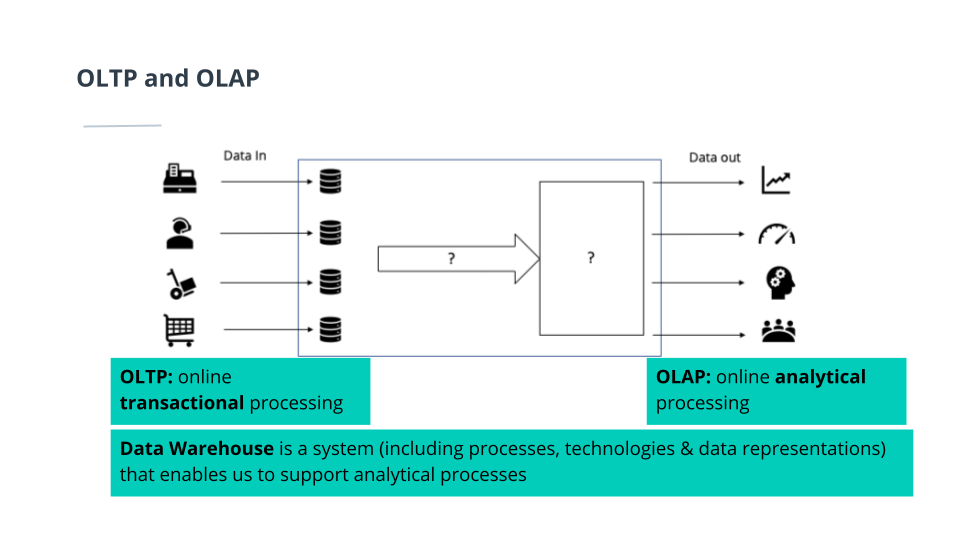
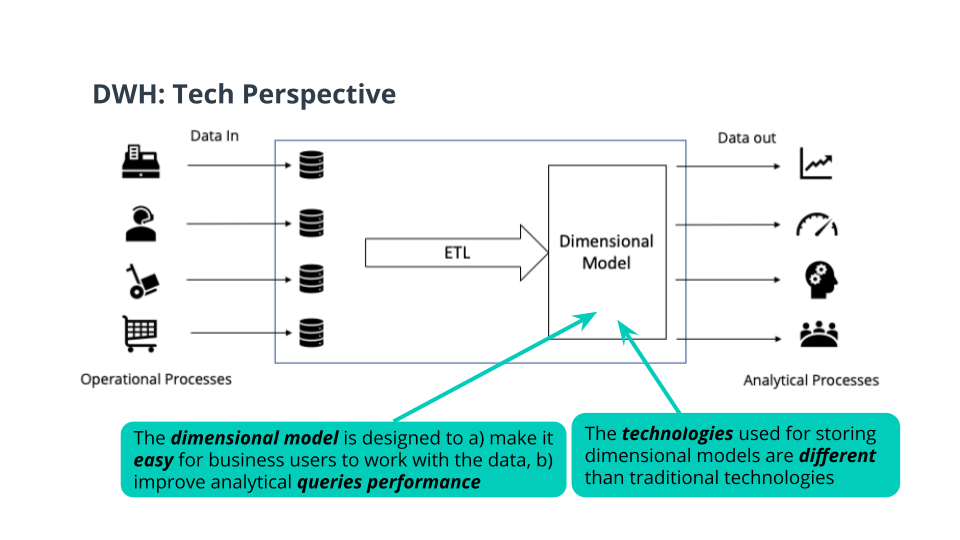
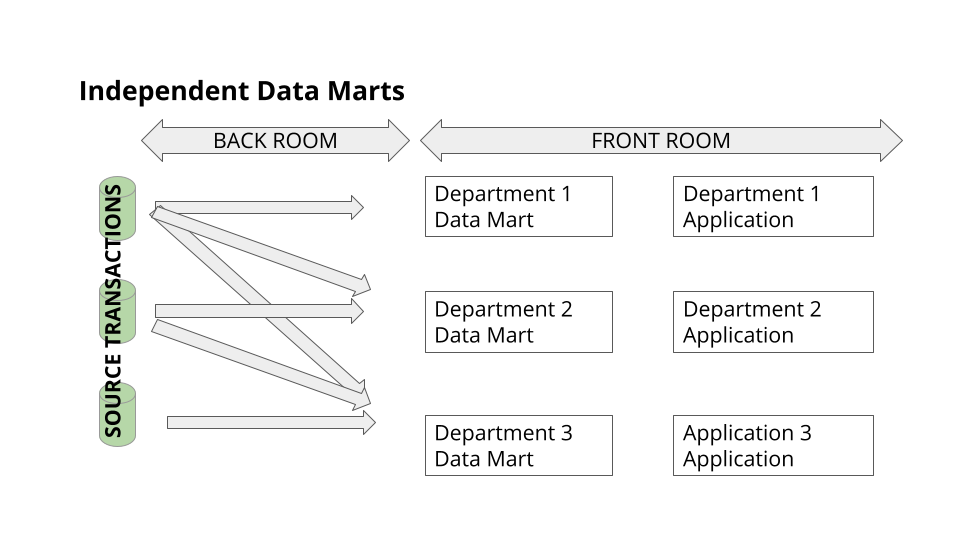
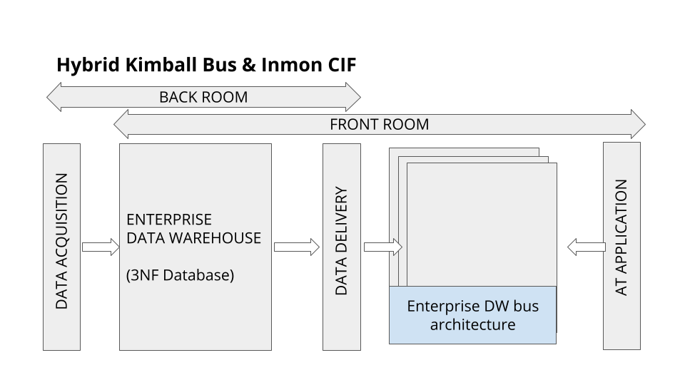
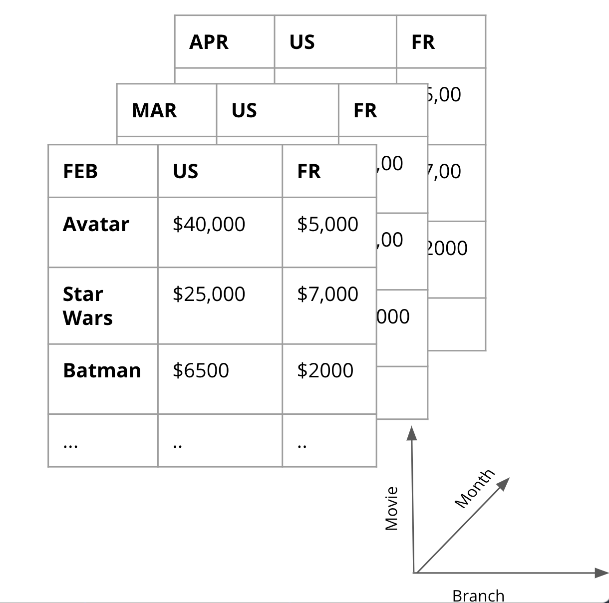

# Introduction to  Data Warehouses 

## Table of Contents
1. [History of Data Warehousing](#history-of-data-warehousing)
2. [Roles and Stakeholders in Data Warehousing](#roles-and-stakeholders-in-data-warehousing)
   - [Business Roles](#business-roles)
   - [Technical Roles](#technical-roles)
3. [Operational vs Analytical Business Processes](#operational-vs-analytical-business-processes)
   - [Operational Processes](#operational-processes)
   - [Analytical Processes](#analytical-processes)
   - [Operational Databases](#operational-databases)
   - [OLTP vs OLAP](#oltp-vs-olap)
4. [Data Warehouse: Technical Perspective](#data-warehouse-technical-perspective)
   - [Goals](#goals)
   - [Technical Perspective](#technical-perspective)
5. [Dimensional Model](#dimensional-model)
   - [Goals of the Star Schema](#goals-of-the-star-schema)
   - [Fact Tables](#fact-tables)
   - [Dimension Tables](#dimension-tables)
   - [Reference Constraints](#reference-constraints)
   - [Example: The DVD Rentals Sample Database](#example-the-dvd-rentals-sample-database)
6. [DWH Architectures](#dwh-architectures)
   - [Kimball's Bus Architecture](#kimballs-bus-architecture)
   - [Independent Data Marts](#independent-data-marts)
   - [Inmon's Corporate Information Factory](#inmons-corporate-information-factory)
   - [Hybrid Kimball Bus & Inmon CIF](#hybrid-kimball-bus--inmon-cif)
7. [OLAP Cubes](#olap-cubes)
   - [Roll Up and Drill Down](#roll-up-and-drill-down)
   - [Slice and Dice](#slice-and-dice)
   - [Query Optimization](#query-optimization)
8. [Definitions](#definitions)
9. [How Do We Serve OLAP Cubes?](#how-do-we-serve-olap-cubes)
10. [Columnar vs Row Storage](#columnar-vs-row-storage)

## History of data warehousing

Data warehousing started in the 1960s, with the term being used starting in the 1970s by Bill Inmon.

Parallel processing led to the development of massively parallel processing architectures in the 1990s. By the early 
2000s, many data storage problems had been solved giving rise to the term "big data." In 2006, the Hadoop project was 
founded and ultimately led to the ability to incorporate semi-structured and unstructured data into modern data warehouses.

## Roles and stakeholders in data warehousing

You will encounter a broad range of stakeholders as a data engineer because this role sits at the center of many 
processes. These roles will typically fall into one of two categories, business or technical.

**Business**:
- Product owners
- Business analysts
- Project managers

**Technical**:
- Database and system administrators
- Data analysts
- Data scientists.
The data engineer is critical to all of these stakeholders.

## Operational vs Analytical Business Processes
Operational Processes: 
- Find goods & make orders (for customers)
- Stock and find goods (for inventory staff)
- Pick up & deliver goods (for delivery staff)

Analytical Processes: 
- Assess the performance of sales staff (for HR)
- See the effect of different sales channels (for marketing)
- Monitor sales growth (for management)

Operational databases:
- Excellent for operations
- No redundancy, high integrity (3NF)
- Too slow for analytics, too many joins
- Too hard to understand

Having the same data source for operational & analytical processes is not a good solution. The general solution is the 
warehouse. We connect to these operational databases and load them to the warehouse. Thats the idea of OLTP vs OLAP.

## Data Warehouse: Technical Perspective
Goal:
- Easy to understand 
- performant
- quality assured
- handles new questions well
- secure

Technical perspective:
- Extract the data from the source systems used for operations, transform the data, and load it into a dimensional model.
- Business-user-facing application are needed, with clear visuals - Business Intelligence (BI) apps

## Dimensional model
Goals of the Star Schema:
- Easy to understand
- Fast analytical query performance

Fact Tables:
- Record business events, like an order, a phone call, a book review
- Fact tables columns record events recorded in quantifiable metrics like quantity of an item, duration of a call, 
a book rating. In most cases, a numerical and additive value.

Dimension Tables:
- Record the context of the business events, e.g. who, what, where, why, etc..
- Dimension tables columns contain attributes like the store at which an item is purchased, or the customer who made 
the call, etc.

Reference constraints in a star schema, are crucial for maintaining data integrity and ensuring accurate, reliable 
reporting:
- **Reference Constraints**: Rules established to maintain consistent relationships between the tables in a star schema, 
often implemented as foreign key constraints.

- **Foreign Key Constraints**: Ensure that each entry in the fact table corresponds to a valid record in a dimension 
table, linking data like sales records in the fact table to specific entities in dimension tables such as products and 
customers.

- **Data Integrity**: These constraints prevent orphan records in the fact table and ensure that data in dimension 
tables can't be deleted or altered in a way that invalidates the relationships.

- **Simplified Queries and Analysis**: By enforcing clear relationships between different data elements, these 
constraints make it easier to write queries and perform analysis.

- **Performance Optimization**: While adding overhead during data loading, reference constraints often improve query 
performance by enabling the database to optimize query execution plans more effectively.

### Example: The DVD Rentals Sample Database. From 3NF to Star schema

- To master the art of dimensional modelling, ones need to see a lot of schemas and think about how to design facts &
dimensions from them.
- the example considered here is called the Sakila database (small database)

**Naive Extract Transform and Load (ETL): From Third Normal Form to ETL**
- Extract:
  - Query the 3NF DB
- Transform:
  - Join tables together
  - Change types
  - Add new columns
- Load:
  - Insert into facts & dimension tables

## DWH Architectures

### Kimball's Bus Architecture

ETL: A Closer Look
- Extracting:
  - Transfer data to the warehouse
  - Possibly deleting old states
- Transforming:
  - Integrates many sources together
  - Possibly cleaning: inconsistencies, duplication, missing values, etc..
  - Possibly producing diagnostic metadata
- Loading:
  - Structuring and loading the data into the dimensional data model

### Independent Data Marts

A data mart is a subset of a data warehouse that is usually oriented to a specific business line or team. Whereas data 
warehouses have enterprise-wide depth, the information in data marts pertains to a single department or business unit.

Data marts are small in size and are more flexible than a data warehouse but are limited in the scope of information. 
They are used by small groups within an organization to analyze and report on specific business functions. For instance, 
the marketing department of a large company might use a data mart to track web analytics or sales performance.

- Departments have separate ETL processes & dimensional models
- These separate dimensional models are called “Data Marts”
- Different fact tables for the same events, no conformed dimensions
- Uncoordinated efforts can lead to inconsistent views
- Despite awareness of the emergence of this architecture from departmental autonomy, it is generally discouraged

### Inmon's Corporate Information Factory

- 2 ETL Process
  - Source systems → 3NF database (data acquisition)
  - 3NF database → Departmental Data Marts (data delivery)
- The 3NF database acts as an enterprise-wide data store.
  - Single integrated source of truth for data-marts
  - Could be accessed by end-users if needed
- Data marts are dimensionally modeled & unlike Kimball’s dimensional models, they are mostly aggregated

### Best of Both Worlds: Hybrid Kimball Bus & Inmon CIF

- Removes Data Marts
- Exposes the enterprise data warehouse

## OLAP cubes

Once we have a star schema, we can create OLAP cubes.

- An OLAP cube is an aggregation of at a number of dimensions
  - Movie, Branch, Month
- Easy to communicate to business users

### Roll Up and Drill Down

- Roll-up: Sum up the sales of each city by Country: e.g. US, France (less columns in branch dimension)
- Drill-Down: Decompose the sales of each city into smaller districts (more columns in branch dimension)
- The OLAP cubes should store the finest grain of data (atomic data), in case we need to drill-down to the lowest level, 
e.g Country -> City -> District -> street ...

### Slice and Dice

- Slice: Reducing N dimensions to N-1 dimensions by restricting one dimension to a single value
- Dice: Same dimensions but computing a sub-cube by restricting, some of the values of the dimensions

### Query Optimization

- Do one pass through the facts table (e.g. with "GROUP BY CUBE(movie, branch, month)"). 
- This will aggregate all possible combinations of grouping.

## Definitions
- **Schema**: The structure of data described in a formal way supported by the database management system.

- **Data Warehouse**: 
  - A central storage of information that can be queried and used for analysis.
  - A data warehouse is a copy of transaction data specifically structured for query and analysis. - Kimball
  - A data warehouse is a subject-oriented, integrated, nonvolatile, and time-variant collection of data in support of 
  management's decisions. - Inmon
  - A data warehouse is a system that retrieves and consolidates data periodically from the source systems into a 
  dimensional or normalized data store. It usually keeps years of history and is queried for business intelligence 
  or other analytical activities. It is typically updated in batches, not every time a transaction happens in the
  source system. -

## How do we serve OLAP cubes?

- Traditional way: Pre-aggregate the OLAP cubes and save them on a special purpose non-relational database (MOLAP).
  (You would by a OLAP server as Microsoft SQL Server Analysis Services, Oracle OLAP or SAP BW)
- Current popular approach: compute the OLAP cubes on the fly from the existing relational databases where the 
dimensional model resides (ROLAP)

## Columnar vs row storage
Columnar storage is faster than raw storage for queries. PostgreSQL and Redshift have extensions that allow usage of 
columnar tables. With these extensions, you can use both raw storage tables and columnar storage tables in the same 
database. The Postgre columnar storage extension used here is cstore_fdw by citus_data
https://github.com/citusdata/cstore_fdw.
