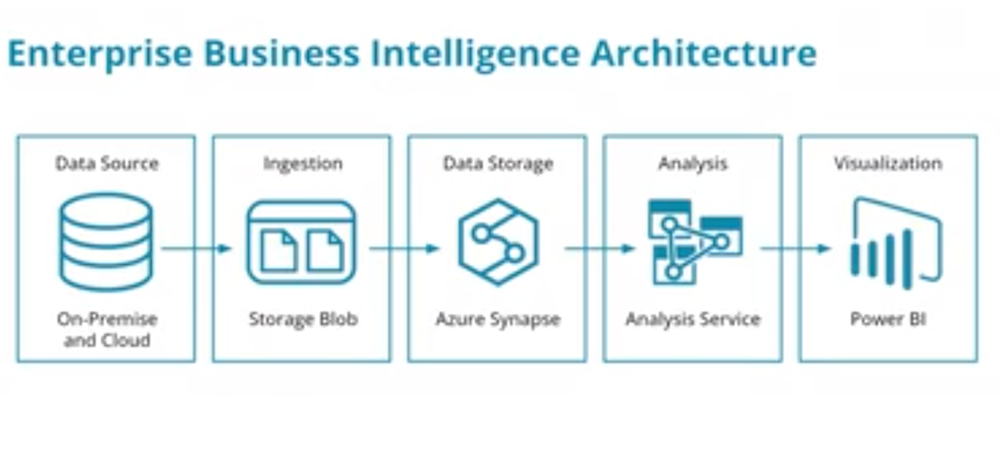
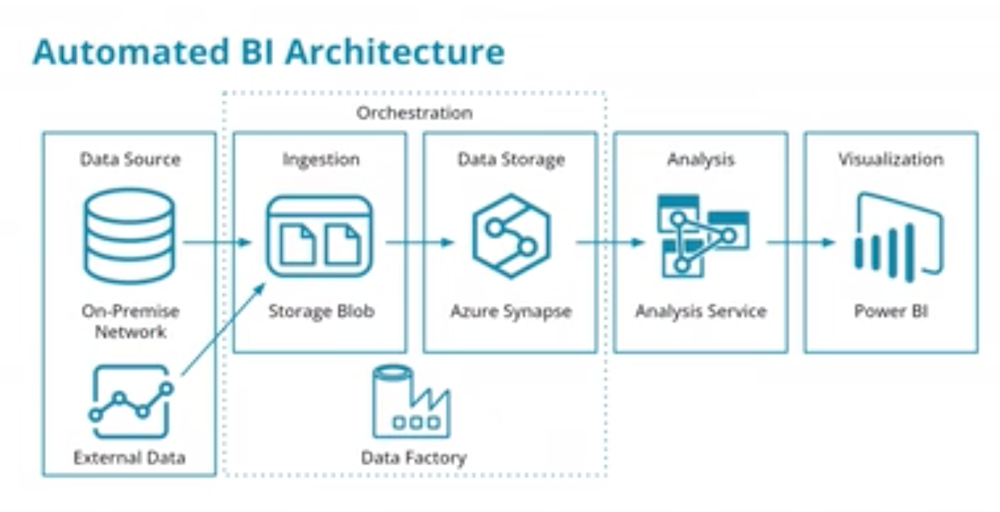
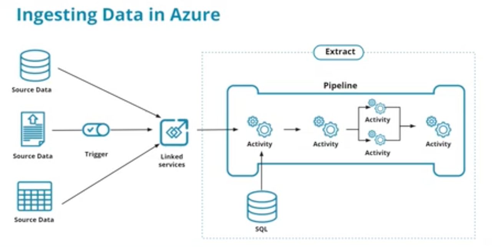
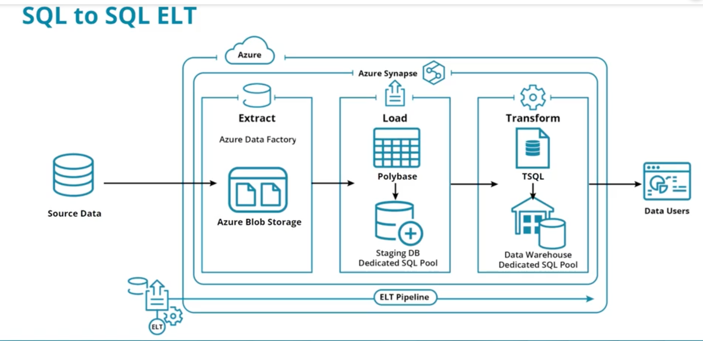

# Implementing Data Warehouses in Azure

## Table of Contents

1. [**Azure Data Warehousing Pricing**](#azure-data-warehousing-pricing)
   - [Batch Data Ingestion](#batch-data-ingestion)
   - [Streaming Data Ingestion](#streaming-data-ingestion)
   - [SQL Data Storage](#sql-data-storage)
   - [NoSQL Data Storage](#nosql-data-storage)
   - [Big Data Analytics](#big-data-analytics)
   - [Log and Telemetry Streaming Analytics](#log-and-telemetry-streaming-analytics)
   - [Benefits of the Mix and Match Approach](#benefits-of-the-mix-and-match-approach)
   - [Cautions for the Mix and Match Approach](#cautions-for-the-mix-and-match-approach)

2. [**Azure Data Warehouse Architectures**](#azure-data-warehouse-architectures)
   - [Enterprise BI Architecture](#enterprise-bi-architecture)
   - [Automated Enterprise BI Architecture](#automated-enterprise-bi-architecture)
   - [Additional Resource on Azure Data Warehouse Architectures](#additional-resource-on-azure-data-warehouse-architectures)

3. [**Ingesting Data at Scale into Azure Synapse**](#ingesting-data-at-scale-into-azure-synapse)
   - [Creating Linked Services](#creating-linked-services)
   - [Creating a Pipeline](#creating-a-pipeline)
   - [Using a Trigger or a One-Time Data Ingestion](#using-a-trigger-or-a-one-time-data-ingestion)
   - [Additional Resources for Ingesting Data into Azure Synapse](#additional-resources-for-ingesting-data-into-azure-synapse)

4. [**SQL to SQL ELT in Azure**](#sql-to-sql-elt-in-azure)
   - [Process Overview](#process-overview)
   - [Definitions](#Definitions)
   - [Dedicated or Serverless SQL Pools](#dedicated-or-serverless-sql-pools)
     - [Azure Dedicated SQL Pools](#azure-dedicated-sql-pools)
     - [Azure Synapse Analytics Serverless SQL Pools](#azure-synapse-analytics-serverless-sql-pools)
   - [Additional Resource on SQL to SQL ELT in Azure](#additional-resource-on-sql-to-sql-elt-in-azure)

## Azure Data Warehousing Pricing

Creating data warehouses using Microsoft Azure technologies requires an understanding of the purpose of each component. 
Azure data warehouse pricing models include:
- Batch Data Ingestion
- Streaming Data Ingestion
- SQL Data Storage
- NoSQL Data Storage
- Big Data Analytics
- Log and Telemetry Streaming Analytics

In some cases, Azure resource pricing is time-based (e.g. Cosmos DB) and in other cases, it is based on the amount of 
data stored or processed (e.g. Blob storage).

Your data warehouse solution in Azure may include all or just some of these options and the pricing models vary from 
the amount of data stored/processed to time-based billing.

Benefits of the mix and match approach:
- Pay for just what you need
- Tailor solution to business needs not the platform

Cautions for the mix and match approach:
- Need to understand a variety of billing models
- Must understand data and time needs for each of the components to understand the total cost for the solution

## Azure Data Warehouse Architectures

### Enterprise BI Architecture

A typical Enterprise DW Architecture involves:
- A Data Source (MS SQL Server)
- An Ingestion Mechanism (Azure Blob Storage)
- Data Storage (Azure Synapse)
- Analysis (Azure Analysis Service)
- Visualization (PowerBI)

### Automated Enterprise BI Architecture

An Automated Enterprise BI Architecture has the same components with the Azure Blob Storage and Azure Synapse components 
orchestrated using Azure Data Factory.

### Additional Resource
Microsoft documentation on [Azure Data Warehouse Architectures](https://docs.microsoft.com/en-us/azure/architecture/data-guide/relational-data/data-warehousing)

## Ingesting Data at scale into Azure Synapse

Ingesting data at scale into Azure Synapse involves:
- **Creating linked services**: a linked service is where you define your connection information to other services
- **Creating a pipeline**: A pipeline contains the logical flow for an execution of a set of activities
- **Using a trigger or a one-time data ingestion**: You can manually start a data ingestion or you can schedule a trigger
  

### Additional Resources:
[Ingesting data into Azure Synapse](https://docs.microsoft.com/en-us/azure/synapse-analytics/quickstart-copy-activity-load-sql-pool)

## SQL to SQL ELT in Azure

### Process Overview

When using Microsoft Azure to implement a data warehouse, the best solution is often to perform a SQL to SQL ELT.

Doing a SQL to SQL ELT in Azure involves:
- Starting with data ingested into either Blob Storage or Azure Data Lake Gen 2
- Create EXTERNAL staging tables in the Data Warehouse
- Transform data from staging tables to DW tables

Once the extract process has landed data into azure blob storage, SQL can be used for the last two steps: load and 
transform: 
- for the load step, Microsoft SQL server Polybase provides a fast, highly efficient method for loading data
from Azure Blob Storage into staging tables created in Azure dedicated SQL pools as external tables.
- when transforming data, Microsoft SQL T-SQL can be used again in Azure dedicated SQL pools to transform data from
staging table schemas to the final data warehouse schemas.

### Definitions

**staging tables**: A staging table is a temporary table used in the process of data integration. When data is extracted 
from source systems, it might not be in a format or structure that is suitable for analytical querying. The staging 
table acts as a landing zone where this raw data can be cleaned, transformed, and enriched before being loaded into the 
final target tables in the data warehouse.

**external**: The term "external" indicates that the staging area is located outside of the primary data 
warehouse storage (dedicated SQL pools). In Azure Synapse, this often refers to Azure Blob Storage or Azure Data Lake 
Storage, which are scalable and cost-effective storage services.

**dedicated SQL pools**: These are a core component of Azure Synapse Analytics, designed specifically for large-scale 
data warehousing and analytics. They offer massively parallel processing (MPP) capabilities to handle complex queries 
and large volumes of data efficiently. Unlike Azure Blob Storage or Azure Data Lake Storage, this dedicated storage 
isn't a standalone Azure storage service. Instead, it's an intrinsic part of the dedicated SQL pools, providing the 
necessary data storage functionality required for data warehousing operations in Azure Synapse Analytics. This storage
is optimized for data warehousing.

### Dedicated or Serverless SQL Pools?
In Azure Synapse Analytics, there are two types of SQL pools to choose from: dedicated SQL pools and serverless SQL 
pools. You can use either for ELT pipeline processes and staging data. They offer different functionalities, performance 
characteristics, and pricing models.
- Serverless SQL Pools are created when you create a Synapse Analytics resource in Azure.
- Dedicated SQL Pools have to be created as a separate resource.

#### Azure Dedicated SQL Pools

Dedicated SQL pools are designed to provide a high-performance, scalable, and cost-effective solution for big data
workloads. They utilize a Massively Parallel Processing (MPP) architecture. A dedicated SQL pool is essentially a 
combination of computing resources and storage resources, specifically designed for large-scale data processing and 
analytics. It comes with dedicated storage integrated into the SQL pool. The storage is optimized for the MPP 
architecture.This architecture enables users to perform queries faster, especially for complex analytical queries. 
Dedicated SQL pools are provisioned with a fixed amount of resources and are billed based on the resources allocated, 
regardless of usage.

When an external table is created in Azure Synapse Analytics using a dedicated SQL pool, it does not store its data in 
either the dedicated SQL pool's storage or in external storage systems like Azure Blob Storage. Instead, the external 
table functions as a virtual schema to facilitate querying of data residing in external storage. The primary roles of 
external tables in Azure Synapse Analytics include:
- **Direct Access to External Data**: They allow for direct querying of data stored in external storage systems, such as 
Azure Blob Storage or Azure Data Lake Storage. This capability enables users to perform SQL queries on the data in its 
original location, eliminating the immediate need to import it into the dedicated SQL pool. This feature is especially 
beneficial for handling large datasets or data stored in data lakes.

- **Staging and Pre-Processing Data**: External tables act as a staging area where data can be explored, cleaned, 
transformed, and prepared while it remains in external storage. This process effectively reduces the volume of data that 
needs to be loaded into the dedicated SQL pool, optimizing the use of resources.

- **Efficient Data Management**: By providing a queryable view over external data, external tables do not duplicate the 
data within the dedicated SQL pool’s storage. This approach maintains efficiency in data handling and minimizes 
- unnecessary data movement, offering a streamlined workflow for data processing and integration.

In a dedicated SQL pool within Azure Synapse Analytics, the data you would typically save and manage is structured data 
that is used for intensive querying, reporting, and analysis as part of your data warehousing strategy. This data is 
often in a format suitable for relational querying and is stored in a way that optimizes performance for such 
operations.

In a Synapse Analytics production data warehouse, you likely would use Dedicated SQL Pools.

#### Azure Synapse Analytics Serverless SQL Pools

Serverless SQL pools provide a pay-per-query model, which means you only pay for the resources used by each executed 
query.  Serverless means it does not require you to provision or manage any resources. It automatically scales to 
accommodate the queries being executed. It does not have dedicated storage. It queries data in place from sources like 
Azure Data Lake Storage.

They are designed to handle both small and large-scale data processing tasks and 
can automatically scale resources based on workload requirements. Serverless SQL pools do not require any upfront 
provisioning or resource allocation.
- For development workloads, ad-hoc querying, or volatile workloads, you can use serverless SQL pools.
- Use Serverless SQL pools if you are using the Udacity Azure Cloud Lab.

The steps for data processing using serverless SQL pools are:
- **Extract and Load**: The process starts similarly, with data being extracted and initially loaded into a format 
accessible by Azure Synapse. External tables are used to access and query this data.

- **Transformation**: Transformations are performed using Serverless SQL pool queries. The transformations can include 
similar operations as in the dedicated pool scenario.

- **Using CETAS**: Instead of loading the transformed data into dedicated storage (which doesn't exist in serverless 
pools), you use CETAS to write the results of these transformations back into external storage like Azure Data Lake or 
Blob Storage. This step effectively materializes the query results.

- **Analytics and Reporting**: The data materialized by CETAS in the external storage can then be used for further 
analytics and reporting. Tools that can access the external storage directly will be used for these purposes.

#### Key Differences between Dedicated and Serverless SQL Pools
- **Storage Location**: In Dedicated SQL pools, transformed data is stored within the pool's dedicated storage, offering 
high performance for analytics. In contrast, Serverless SQL pools use CETAS to store transformed data back into external 
storage like Azure Blob Storage or Azure Data Lake.

- **Resource Management and Scalability**: Dedicated SQL pools require management of compute and storage resources, 
including scaling based on workload. Serverless SQL pools, on the other hand, are inherently scalable and require no 
- upfront provisioning, with costs based on the amount of data processed.

- **Use Case Suitability**: Dedicated SQL pools are ideal for large-scale, regular analytics where performance and 
resource availability are critical. Serverless SQL pools are more suited for ad-hoc querying, exploratory analysis, and 
- scenarios where workload is intermittent or unpredictable.

### Additional Resource
[SQL to SQL ELT in Azure](https://docs.microsoft.com/en-us/azure/architecture/data-guide/relational-data/etl)

