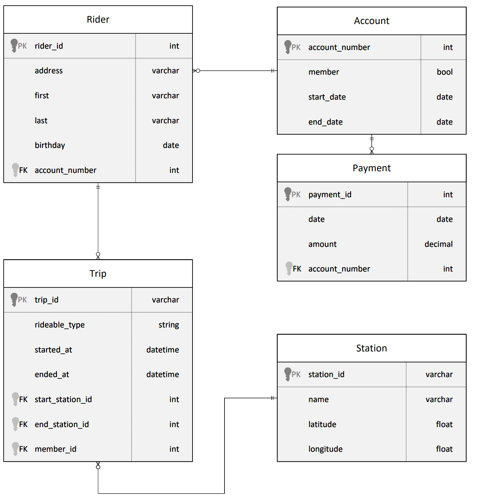

# Project: Cloud Data Warehouses with Azure 

## Project overview

Divvy is a bike sharing program in Chicago, Illinois USA that allows riders to purchase a pass at a kiosk or use a 
mobile application to unlock a bike at stations around the city and use the bike for a specified amount of time. The 
bikes can be returned to the same station or to another station. The City of Chicago makes the anonymized bike trip data 
publicly available for projects like this where we can analyze the data.

Since the data from Divvy are anonymous, we have created fake rider and account profiles along with fake payment data to 
go along with the data from Divvy. The dataset looks like this:



The goal of this project is to develop a data warehouse solution using Azure Synapse Analytics. You will:
- Design a star schema based on the business outcomes listed below;
- Import the data into Synapse;
- Transform the data into the star schema;
- and finally, view the reports from Analytics.

The business outcomes you are designing for are as follows:
- Analyze how much time is spent per ride
  - Based on date and time factors such as day of week and time of day
  - Based on which station is the starting and / or ending station
  - Based on age of the rider at time of the ride
  - Based on whether the rider is a member or a casual rider
- Analyze how much money is spent
  - Per month, quarter, year
  - Per member, based on the age of the rider at account start
- EXTRA CREDIT - Analyze how much money is spent per member
  - Based on how many rides the rider averages per month
  - Based on how many minutes the rider spends on a bike per month

If you are not fully familiar with date dimensions, this article from MSSQL Tips on 
[Creating a date dimension or calendar table in SQL Server](https://www.mssqltips.com/sqlservertip/4054/creating-a-date-dimension-or-calendar-table-in-sql-server/) 
is a good refresh.

The dataset can be found [here](https://video.udacity-data.com/topher/2022/March/622a5fc6_azure-data-warehouse-projectdatafiles/azure-data-warehouse-projectdatafiles.zip)

## Instructions

### Checklist
Project checklist:
- PDF of the star schema
- screenshot of the linked azure blob storage showing the 4 datasets copied from Postgres (Proof of extract step)
- scripts used for external table create and load into text files (proof of load step). You will have 4 of these 
named Load1.txt, ..., Load4.txt
- SQL code for creating each of the tables in the star schema. Name these files accordingly to the table name.sql.

### Tasks
#### Task 1: Create your Azure resources
- Create an Azure Database for PostgresSQL.
- Create an Azure Synapse workspace. Note that if you've previously created a Synapse Workspace, you do not need to create 
a second one specifically for the project.
- Use the built-in serverless SQL pool and database within the Synapse workspace

#### Task 2: Design a star schema
You are being provided a relational schema that describes the data as it exists in PostgresSQL. In addition, you have 
been given a set of business requirements related to the data warehouse. You are being asked to design a star schema 
using fact and dimension tables.

#### Task 3: Create the data in PostgresSQL
To prepare your environment for this project, you first must create the data in PostgresSQL. This will simulate the 
production environment where the data is being used in the OLTP system. This can be done using the Python script provided 
for you in GitHub: [ProjectDataToPostgres.py](https://github.com/udacity/Azure-Data-Warehouse-Project/tree/main/starter)

- Download the script file and place it in a folder where you can run a Python script
- [Download the data files](https://video.udacity-data.com/topher/2022/March/622a5fc6_azure-data-warehouse-projectdatafiles/azure-data-warehouse-projectdatafiles.zip) 
from the classroom resources
- Open the script file in VS Code and add the host, username, and password information for your PostgresSQL database
- Run the script and verify that all four data files are copied/uploaded into PostgresSQL. You can verify this data 
exists by using pgAdmin or a similar PostgresSQL data tool.

#### Task 4: EXTRACT the data from PostgresSQL
In your Azure Synapse workspace, you will use the ingest wizard to create a one-time pipeline that ingests the data from 
PostgresSQL into Azure Blob Storage. This will result in all four tables being represented as text files in Blob Storage, 
ready for loading into the data warehouse

#### Task 5: LOAD the data into external tables in the data warehouse
Once in Blob storage, the files will be shown in the data lake node in the Synapse Workspace. From here, you can use the 
script-generating function to load the data from blob storage into external staging tables in the data warehouse you 
created using the serverless SQL Pool.

Notes:
- Even though your data is stored in Azure Blob Storage, Azure Synapse Workspace can present this data through what is 
known as a "data lake node." This node is essentially a representation or a view that allows you to perform data 
lake-related operations on data stored in Blob Storage. It does not mean that the data is physically located in a Data 
Lake Storage; rather, it's about how the data is accessed and managed within the Synapse environment.
- When you start the script-generating function or wizard from the data lake node perspective within Synapse Workspace 
it leverages the data lake capabilities of Synapse, such as handling large datasets and utilizing serverless SQL pools 
for querying.

Helpful Hints:
- When you use the ingest wizard, it uses the copy tool to EXTRACT into Blob storage. During this process, Azure 
Synapse automatically creates links for the data lake. When you start the SQL script wizard to LOAD data into external 
tables, start the wizard from the data lake node, not the blob storage node. 
- When using the external table wizard, you may need to modify the script to put dates into a varchar field in staging 
- rather than using the datetime data type. You can convert them during the transform step.
- When using the external table wizard, if you rename the columns in your script, it will help you when writing 
transform scripts. By default, they are named 'C1', 'C2', etc. which are not useful column names in staging.

#### Task 6: TRANSFORM the data to the star schema using CETAS

Write SQL scripts to transform the data from the staging tables to the final star schema you designed.

The serverless SQL pool won't allow you to create persistent tables in the database, as it has no local storage. So, 
use `CREATE EXTERNAL TABLE AS SELECT ` (CETAS) instead. CETAS is a parallel operation that creates external table 
metadata and exports the SELECT query results to a set of files in your storage account.

**Tip**: For creating fact tables out of join between dimensions and staging tables, you can use CETAS to materialize 
joined reference tables to a new file and then join to this single external table in subsequent queries.


Create a new SQL script, and ensure you are connected to the serverless SQL pool and your SQL database.


##### 1. Define the file format, if not already. You don't have run this query for each CETAS.

We will rely on external tables, created in the previous LOAD step, as the source for CETAS. Assuming you have the 
staging external tables ready, use the syntax below to define the CETAS.
    
```sql
-- Use the same file format as used for creating the External Tables during the LOAD step.
IF NOT EXISTS (SELECT * FROM sys.external_file_formats WHERE name = 'SynapseDelimitedTextFormat') 
    CREATE EXTERNAL FILE FORMAT [SynapseDelimitedTextFormat] 
    WITH ( FORMAT_TYPE = DELIMITEDTEXT ,
           FORMAT_OPTIONS (
             FIELD_TERMINATOR = ',',
             USE_TYPE_DEFAULT = FALSE
            ))
GO
```

In this snippet, the file format is being defined for reading in the data from a comma delimited file stored in blob 
storage. Note - The script above is for reference only. It was autogenerated during the LOAD step, when we created the 
External tables from the Blob storage. Therefore, use the one auto-generated for you.

##### 2. Define the data source to persist the results.
```sql
-- Use the same data source as used for creating the External Tables during the LOAD step.
-- Storage path where the result set will persist
IF NOT EXISTS (SELECT * FROM sys.external_data_sources WHERE name = 'mydlsfs20230413_mydls20230413_dfs_core_windows_net') 
    CREATE EXTERNAL DATA SOURCE [mydlsfs20230413_mydls20230413_dfs_core_windows_net] 
    WITH (
        LOCATION = 'abfss://mydlsfs20230413@mydls20230413.dfs.core.windows.net' 
    )
GO
```

In this snippet, the external data source is being created in SQL so the data can be read directly into an external 
table. Use the blob storage account name as applicable to you. The script above was autogenerated during the LOAD step, 
when we created the External tables from the Blob storage.

mydlsfs20230413@mydls20230413: This part is divided into two segments:
- mydlsfs20230413: This is the name of the file system (similar to a container in Azure Blob Storage) within the ADLS 
Gen2 account.
- mydls20230413: This is the name of the storage account.

##### 3. Use CETAS to export select statement. 

```sql
IF OBJECT_ID('dbo.fact_payment') IS NOT NULL 
  BEGIN DROP EXTERNAL TABLE [dbo].[fact_payment]; 
  END

CREATE EXTERNAL TABLE dbo.fact_payment
WITH (
    LOCATION     = 'fact_payment',
    DATA_SOURCE = [mydlsfs20230413_mydls20230413_dfs_core_windows_net],
    FILE_FORMAT = [SynapseDelimitedTextFormat]
)  
AS
SELECT [payment_id], [amount], [date]
FROM [dbo].[staging_payment];
GO
```
The query above will read the data from dbo.staging_payment external table, and persist the results in the 
fact_payment/ directory as CSV format.

A sample illustration showing the CETAS query. The attributes in the SELECT clause and the source External table will 
vary for your use-case.


##### 4. Finally, query the newly created CETAS external table, and ensure you get the desired output.
```sql
SELECT TOP 100 * FROM dbo.fact_payment
GO
```

You can also explore the Linked data source to verify the results:


#### Reference:

- [CETAS in serverless SQL pool](https://learn.microsoft.com/en-us/azure/synapse-analytics/sql/develop-tables-cetas#cetas-in-serverless-sql-pool)
- [How to use CETAS on serverless SQL pool](https://techcommunity.microsoft.com/t5/azure-synapse-analytics-blog/how-to-use-cetas-on-serverless-sql-pool-to-improve-performance/ba-p/3548040)
- [Best practices for serverless SQL pool in Azure Synapse Analytics](https://learn.microsoft.com/en-us/azure/synapse-analytics/sql/best-practices-serverless-sql-pool)


