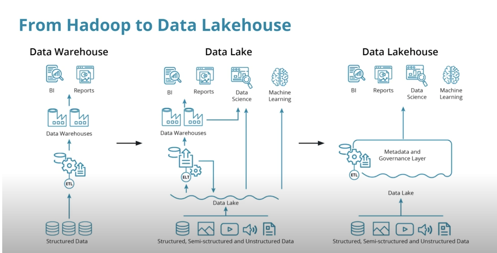
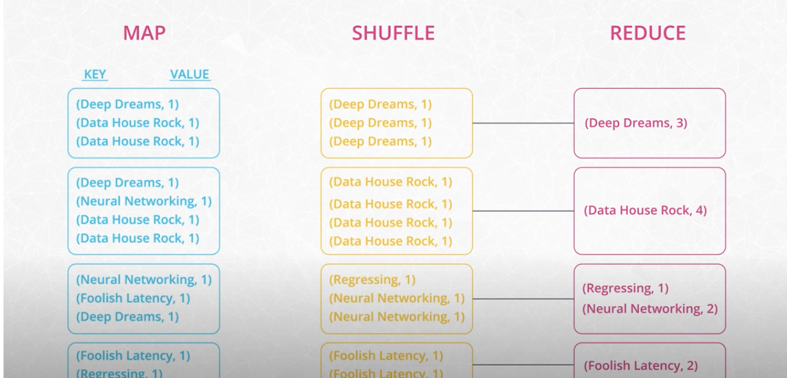

# Big Data Ecosystem, Spark, and Data Lakes

## Table of Contents

- [Introduction](#introduction)
- [From Hadoop to Data Lakehouses](#from-hadoop-to-data-lakehouses)
- [The Hadoop Ecosystem](#the-hadoop-ecosystem)
  - [Hadoop Vocabulary](#hadoop-vocabulary)
  - [How is Spark related to Hadoop?](#how-is-spark-related-to-hadoop)
  - [Streaming Data](#streaming-data)
- [MapReduce](#mapreduce)
- [Spark](#spark)
  - [Why Spark?](#why-spark)
  - [The Spark Cluster](#the-spark-cluster)
  - [Spark Use Cases](#spark-use-cases)
    - [You Don't Always Need Spark](#you-dont-always-need-spark)
    - [Spark's Limitations](#sparks-limitations)
    - [Hadoop versus Spark](#hadoop-versus-spark)
    - [Beyond Spark for Storing and Processing Big Data](#beyond-spark-for-storing-and-processing-big-data)
- [Data Lakes](#data-lakes)
  - [Key Characteristics of Data Lakes](#key-characteristics-of-data-lakes)
  - [Apache Spark, Data Lakes, and Lakehouse](#apache-spark-data-lakes-and-lakehouse)
- [Data Lakehouse](#data-lakehouse)
  - [Lakehouse Architecture](#lakehouse-architecture)
  - 
## Introduction

With data being generated by humans through social media and by machines through the Internet of Things, we continue to 
experience exponential growth in the amount of data that must be transmitted, stored, processed, and analyzed. The 
technology we use to handle big data is constantly changing.

The architectures and processes are evolving from the data warehouse, giving way to the now ubiquitous data lake, which 
in turn is giving way to an architecture called lakehouse. 

The modern big data ecosystem is an evolution of data processing on distributed architecture necessary to handle the 
sheer volume of data.

As businesses began gathering and processing ever larger amounts of data, the field of data science arose around the 
need to thoughtfully ask questions of data and answer them using scientific methods of discovery. In addition, 
ever-increasing amounts of data along with greater processing power led to a surge in artificial intelligence research.

Data Science and AI are immensely important to the modern business but without a big data ecosystem to move, store, 
clean, merge, and tidy up data, these tools are not effective. This is why the work of a data engineer is so critical. 

Early efforts at processing large amounts of structured, semi-structured, and unstructured data led to the development 
of Hadoop. Hadoop incorporates two key components:
- The Hadoop Distributed File System (or HDFS) provides distributed storage with high-throughput access to data.
- MapReduce provides a way to conduct massive parallel processing for large amounts of data.
The next step in the evolution was Apache Spark.

Spark built on the ideas of Hadoop and provided multiple programming APIs for processing data as well as providing an 
interactive interface for iteratively developing data engineering and data science solutions.

Hadoop and Spark have led to the development and popularity of data lakes to process large amounts of both structured 
and unstructured data.

Finally, the latest step in the evolution of big data ecosystems is the lake house architecture. Lake house seeks to 
combine the strengths of both data lakes and data warehouses.

## From Hadoop to Data Lakehouses

Hadoop and Spark enabled the evolution of the data warehouse to the data lake.

Data warehouses are based on specific and explicit data structures that allow for highly performant business 
intelligence and analytics but they do not perform well with unstructured data.

Data lakes are capable of ingesting massive amounts of both structured and unstructured data with Hadoop and Spark 
providing processing on top of these datasets.

Data lakes have several shortcomings that grew out of their flexibility. They are unable to support transactions and 
perform poorly with changing datasets. Data governance became difficult due to the unstructured nature of these systems.

Modern lakehouse architectures seek to combine the strengths of data warehouses and data lakes into a single, powerful 
architecture.

## The Hadoop Ecosystem

### Hadoop vocabulary

Here is a list of some terms associated with Hadoop:

- **Hadoop** - an ecosystem of tools for big data storage and data analysis. Hadoop is an older system than Spark but is 
still used by many companies. The major difference between Spark and Hadoop is how they use memory. Hadoop writes 
intermediate results to disk whereas Spark tries to keep data in memory whenever possible. This makes Spark faster for 
many use cases.
- **Hadoop MapReduce** - a system for processing and analyzing large data sets in parallel.
- **Hadoop YARN** - a resource manager that schedules jobs across a cluster. The manager keeps track of what computer 
resources are available and then assigns those resources to specific tasks.
- **Hadoop Distributed File System (HDFS)** - a big data storage system that splits data into chunks and stores the 
chunks across a cluster of computers.

As Hadoop matured, other tools were developed to make Hadoop easier to work with. These tools included:
- **Apache Pig** - a SQL-like language that runs on top of Hadoop MapReduce
- **Apache Hive** - another SQL-like interface that runs on top of Hadoop MapReduce

Oftentimes when someone is talking about Hadoop in general terms, they are actually talking about Hadoop MapReduce. 
However, Hadoop is more than just MapReduce. 

### How is Spark related to Hadoop?

Spark, which is the main focus of this course, is another big data framework. Spark contains libraries for data 
analysis, machine learning, graph analysis, and streaming live data. Spark is generally faster than Hadoop. This is 
because Hadoop writes intermediate results to disk whereas Spark tries to keep intermediate results in memory whenever 
possible.

The Hadoop ecosystem includes a distributed file storage system called HDFS (Hadoop Distributed File System). Spark, on 
the other hand, does not include a file storage system. You can use Spark on top of HDFS but you do not have to. Spark 
can read in data from other sources as well.

### Streaming Data
Data streaming is a specialized topic in big data. The use case is when you want to store and analyze data in real-time 
such as Facebook posts or Twitter tweets.

Spark has a streaming library called [Spark Streaming](https://spark.apache.org/docs/latest/streaming-programming-guide.html). 
Other popular streaming libraries include [Storm](http://storm.apache.org/) and [Flink](https://flink.apache.org/). 
Streaming won't be covered here, but you can follow these links to learn more about these technologies.

## MapReduce

MapReduce is a programming technique for manipulating large data sets. "Hadoop MapReduce" is a specific implementation 
of this programming technique.

The technique works by first dividing up a large dataset stored on HDFS and distributing the data across a cluster. HDFS
handles the process of breaking the data up into smaller chunks (partitions) so that commodity machines can handle the 
computational load. We have then three well-defined steps:
- in the **map** step, each data in each partition is analyzed and converted into a (key, value) pair. 
- **shuffle step**: Once all the map processes are completed, these key-value pairs are shuffled across the cluster 
so that all keys are on the same machine. 
- In the **reduce** step, the values with the same keys are combined together.

While Spark doesn't implement MapReduce, you can write Spark programs that behave in a similar way to the map-reduce 
paradigm. 

## Spark

### Why Spark?

Spark is currently one of the most popular tools for big data analytics. Hadoop is a slightly older technology, although 
still in use by some companies. Spark is generally faster than Hadoop, which is why Spark has become more popular over 
the last few years.

There are many other big data tools and systems, each with its own use case. For example, there are database system like 
Apache Cassandra and SQL query engines like Presto. But Spark is still one of the most popular tools for analyzing large 
data sets.

### The Spark Cluster

When we talk about distributed computing, we generally refer to a big computational job executing across a cluster of 
nodes. Each node is responsible for a set of operations on a subset of the data. At the end, we combine these partial 
results to get the final answer. But how do the nodes know which task to run and demote order? Are all nodes equal? 
Which machine are you interacting with when you run your code?

Most computational frameworks are organized into a master-worker hierarchy:
- The master node is responsible for orchestrating the tasks across the cluster
- Workers are performing the actual computations

There are four different modes to setup Spark:
- Local mode: In this case, everything happens on a single machine. So, while we use spark's APIs, we don't really do 
any distributed computing. The local mode can be useful to learn syntax and to prototype your project.
- distributed mode: The other three modes are distributed and declare a cluster manager. The cluster manager is a 
separate process that monitors available resources and makes sure that all machines are responsive during the job. 
There are three different options of cluster managers:
  - Spark's own Standalone Cluster Manager. In Spark's Standalone mode there is a Driver Process. If you open a Spark 
  shell, either Python or Scala, you are directly interacting with the driver program. It acts as the master and is 
  responsible for scheduling tasks.
  - YARN from the Hadoop project
  - Another open-source manager from UC Berkeley's AMPLab Coordinators called Mesos.

### Spark use cases

#### You Don't Always Need Spark
Spark is meant for big data sets that cannot fit on one computer. But you don't need Spark if you are working on 
smaller data sets. In the cases of data sets that can fit on your local computer, there are many other options out there 
you can use to manipulate data such as:
- AWK - a command line tool for manipulating text files
- R 
- Python data libraries, which include Pandas, Matplotlib, NumPy, and scikit-learn among other libraries

If the data is already stored in a relational database such as MySQL or Postgres, you can leverage SQL to extract, 
filter and aggregate the data. If you would like to leverage pandas and SQL simultaneously, you can use libraries such 
as SQLAlchemy, which provides an abstraction layer to manipulate SQL tables with generative Python expressions.

#### Spark's Limitations
Spark Streaming’s latency is at least 500 milliseconds since it operates on micro-batches of records, instead of 
processing one record at a time. Native streaming tools such as Storm, Apex, or Flink can push down this latency value 
and might be more suitable for low-latency applications. Flink and Apex can be used for batch computation as well, so if 
you're already using them for stream processing, there's no need to add Spark to your stack of technologies.

Another limitation of Spark is its selection of machine learning algorithms. Currently, Spark only supports algorithms 
that scale linearly with the input data size. In general, deep learning is not available either, though there are many 
projects that integrate Spark with Tensorflow and other deep learning tools.

#### Hadoop versus Spark
The Hadoop ecosystem is a slightly older technology than the Spark ecosystem. In general, Hadoop MapReduce is slower 
than Spark because Hadoop writes data out to disk during intermediate steps. However, many big companies, such as 
Facebook and LinkedIn, started using Big Data early and built their infrastructure around the Hadoop ecosystem.

While Spark is great for iterative algorithms, there is not much of a performance boost over Hadoop MapReduce when doing 
simple counting. Migrating legacy code to Spark, especially on hundreds of nodes that are already in production, might 
not be worth the cost for the small performance boost.

#### Beyond Spark for Storing and Processing Big Data
Keep in mind that Spark is not a data storage system, and there are a number of tools besides Spark that can be used to 
process and analyze large datasets.

Sometimes it makes sense to use the power and simplicity of SQL on big data. For these cases, a new class of databases, 
know as NoSQL and NewSQL, have been developed.

For example, you might hear about newer database storage systems like HBase or Cassandra. There are also distributed SQL 
engines like Impala and Presto. 

## Data Lakes

With a data warehouse, you can imagine lining up all the data as it is ingested much like goods stacked on a shelf in a 
warehouse, which are pulled off in an orderly manner. Data has to be structured going in and out of the warehouse.

A data lake on the other hand, pours all of the data into a single repository, ready to be consumed by whoever and 
wherever they need.

### Key Characteristics of Data Lakes

Data lakes are an evolution beyond data warehouses and allow an organization to ingest massive amounts of both 
structured and unstructured data into storage. One of the key differences between data warehouses and data lakes is the 
inclusion of structured versus unstructured data. Data warehouses consist of only highly structured data that is 
suitable for business intelligence and reporting needs.

Often data science and machine learning efforts need access to all data, including unstructured data. Data lakes provide 
the ability to serve up both types of data from a single data store. The key features of data lakes include:
- Lower costs associated with using big data tools for ETL / ELT operations.
- Data lakes provide schema-on-read rather than schema-on-write which lowers the cost and work of ingesting large 
amounts of data.
- Data lakes provide support for structured, semi-structured, and unstructured data.

### Apache Spark, Data Lakes, and Lakehouse
Apache Spark can be used to perform data engineering tasks for building both data lakes and lakehouse architectures.
Most often, these data engineering tasks consist of ETL or ELT tasks. Apache Spark allows the data engineer to perform 
these tasks, along with raw data ingestion using the language of their choice with support for Python, R, SQL, Scala, 
and Java.

## Data Lakehouse

Data lakes were a huge step forward from data warehouses but some of their key features led to weaknesses. With the need 
to ingest a large amount of unstructured data, we lost:
- Atomic transactions: failed production jobs left data in a corrupted state.
- Quality enforcement: inconsistent and therefore unusable data.
- Consistency in data structures: impossible to stream and batch process data while ingesting.

These shortcomings led the industry to seek better solutions.

### Lakehouse Architecture

One of the important features of a lakehouse architecture is the ability to quickly ingest large amounts of data and 
then incrementally improve the quality of the data. We can think of this process using the colors we often associate 
with Olympic medals:
- Raw ingested data can be considered bronze.
- After some filtering, cleaning, and augmenting, the data can be considered silver.
- Finally, with the addition of business-level aggregates such as you might see with a star schema, data can be 
considered gold and ready for analytics and reporting needs.

The key difference between data lakes and data lakehouse architectures is the inclusion of the metadata and governance 
layer. This is the crucial ingredient that provides atomicity, data quality, and consistency for the underlying data lake.

