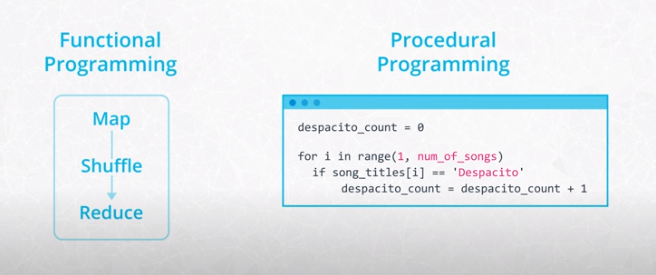
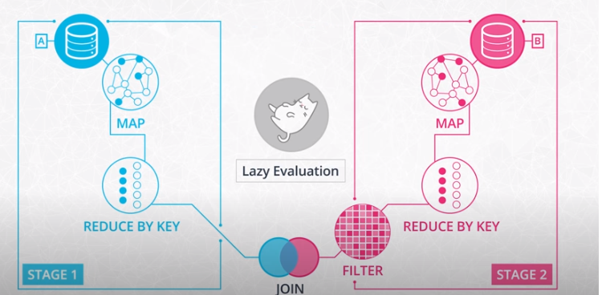
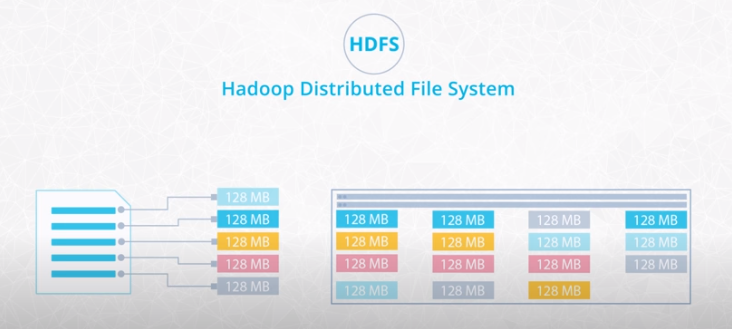
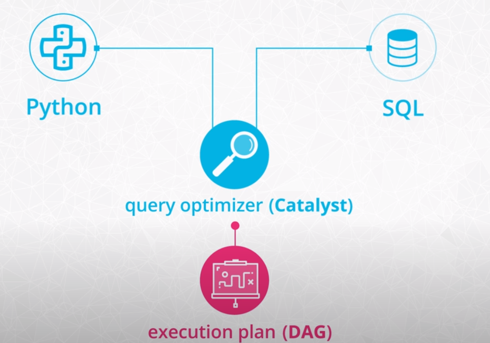

# Data Wrangling with Spark

## Table of Contents

- [Functional Programming](#functional-programming)
  - [Introduction](#introduction)
  - [Why Use Functional Programming?](#why-use-functional-programming)
  - [Procedural Programming Example](#procedural-programming-example)
  - [Pure Functions Analogy](#pure-functions-analogy)
- [Spark](#spark)
  - [Spark DAGs](#spark-dags)
  - [Maps and Lambda Functions](#maps-and-lambda-functions)
  - [Distributed Data Stores](#distributed-data-stores)
  - [SparkSession](#sparksession)
  - [Reading and Writing Data into Spark Data Frames](#reading-and-writing-data-into-spark-data-frames)
- [Imperative vs Declarative Programming](#imperative-vs-declarative-programming)
  - [Data Wrangling with Data Frames](#data-wrangling-with-data-frames)
    - [General Functions](#general-functions)
    - [Aggregate Functions](#aggregate-functions)
    - [User Defined Functions (UDF)](#user-defined-functions-udf)
    - [Window Functions](#window-functions)
  - [Spark SQL](#spark-sql)
    - [Spark SQL Resources](#spark-sql-resources)
    - [Useful Instructions](#useful-instructions)
  - [Resilient Distributed Datasets (RDDs)](#resilient-distributed-datasets-rdds)

## Functional Programming

### Introduction

One of the hardest parts of learning Spark is becoming familiar with the functional style of programming. Under the 
hood, Spark is written in a functional programming language called Scala.
- When you're programming with functional languages, you end up solving problems in a pretty different way than you would 
if you're using a general purpose language like Python.
- Although Spark is written in Scala, you can use it with other languages like Java, R, and even Python. 

Even when you're using the PySpark API, you'll see the functional programming influence of Scala. For example, in 
the last lesson, you saw a MapReduce problem that counted up the number of times a song was played.
- This code went through each record and spit out a tuple with the name of the song, and the number one.
- The tuples were shuffled and reduced to a sum of the ones that came with each song name.

If you're used to counting with For Loops and found that logic a little strange, it's because this was a functional 
approach to summing up songs

In the procedural style, you'd use a counter variable to keep track of the play count for each song. Then you'd iterate 
through all the songs, and increment the counter by one if the song name matched.



### Why use functional programming?

The core reason Spark uses functional programming is that functional programming is perfect for distributed systems.
- Functional programming helps minimize mistakes that can cripple an entire distributed system.
- Functional programming gets its name from the functions you saw in your algebra class. These functions are stricter 
than your average Python function because in math a function can only give you one answer when you give it an input. 
On the other hand, Python allows you to make some flexible, albeit complex, functions that depend on the input and 
other parameters.
- When you evaluate a mathematical function, you would never change the inputs of that function, but this is exactly 
what can happen in Python.

### Procedural Programming example
Consider a scenario where executing code updates a global variable to track the play count of a song. Running this code multiple times could yield varied outcomes. This illustrates a fundamental challenge:
- Identifying issues becomes straightforward in such a singular example. However, the complexity escalates when numerous 
machines execute code concurrently, especially if recalculations are necessary due to occasional problems with any of 
the machines.
- In the context of Python programming, the term "function" is frequently used to describe any code following a `def` 
keyword. However, a more precise terminology would differentiate between methods or procedures and true functions, 
indicating that what we often call functions may not adhere to the strict definition of pure functions.

### Pure functions analogy
Imagine your program is like a bread factory, and your function is a specific machine in your factory that makes 
sourdough bread. But since your factory needs to mass-produce bread at a large scale, you need to be a bit more careful.

One thing you'll need to avoid when designing your bread-maker is unintended side effects.
- After each loaf, your machine needs to leave the factory exactly the same as before it ran.
- If you don't, each machine could start interfering with the others.

For example, if running a single bread-maker made the entire factory one degree warmer, then running several of these 
machines all at once would start to heat up the room.

In distributed systems, your functions shouldn't have side effects on variables outside their scope, since this could 
interfere with other functions running on your cluster.
- Your bread making machine needs to get the ingredients without ruining them since other breadmakers will also need them.
- In distributed systems, you also need to be careful with how you design your functions. Whenever your functions run 
on some input data, it can alter it in the process. If your bread-making machine protects the input ingredients and 
doesn't cause any side effects, then you have a smooth and clean operation.

If you write functions that **preserve their inputs** and **avoid side effects**, these are called **pure functions**, 
and your spark code will work well at the scale of big data.

## Spark

### Spark DAGs
Every Spark function makes a copy of its input data and never changes the original parent data. Because Spark doesn't 
change or mutate the input data, it's known as **immutable**. This makes sense when you have a single function. But what 
happens when you have lots of functions in your program?
- In Spark, you do this by chaining together multiple functions that each accomplish a small chunk of the work.
- You'll often see a function that is composed of multiple sub-functions
- In order for this big function to be peer, each sub function also has to be peer.

If seems that Spark would need to make a copy of the input data for each subfunction. If this was the case your Spark 
program would run out of memory pretty quickly. To avoid this issue, Spark uses a functional programming concept 
called **lazy evaluation**. Before Spark does anything with the data in your program, it first built step-by-step 
directions of what functions and data it will need. In Spark, this is called a **Directed Acyclic Graph (DAG)**. 
Once Spark builds the DAG from your code, it checks if it can procrastinate, waiting until the last possible moment to 
get the data. In Spark, these multi-step combos are called **stages**.



### Maps and Lambda Functions
one of the most common functions in Spark is Maps. Maps simply make a copy of the original input data, and transform 
that copy according to whatever function you put inside the map. You can think about them as directions for the data 
telling each input how to get to the output.

After some initialization to use Spark in our notebook, we:
- Convert our log of songs which is just a normal Python list, and to a distributed dataset that Spark can use. This 
uses the special Spark context object, which is normally abbreviated to SC. The Spark context has a method parallelize 
that takes a Python object and distributes the object across the machines in your cluster, so Spark can use its 
functional features on the dataset.
- Once we have this small dataset accessible to Spark, we want to do something with it. One example is to simply convert 
the song title to a lowercase which can be a common pre-processing step to standardize your data.
- Next, we'll use the Spark function map to apply our converts song to lowercase function on each song in our dataset.
- You'll notice that all of these steps appear to run instantly but remember, the spark commands are using lazy 
evaluation, they haven't really converted the songs to lowercase yet. So far, Spark is still procrastinating to 
transform the songs to lowercase, since you might have several other processing steps like removing punctuation, Spark 
wants to wait until the last minute to see if they can streamline its work, and combine these into a single stage.
- If we want to force Spark to take some action on the data, we can use the collect Function which gathers the results 
from all of the machines in our cluster back to the machine running this notebook.
- You can use anonymous functions in Python, use this special keyword Lambda, and then write the input of the function 
followed by a colon, and the expected output. You'll see anonymous functions all over the place in Spark. They're 
completely optional, you could just define functions if you prefer, but there are best-practice, and small examples 
like these.

For more about the theory and origins of lambda functions, take a look at this [blog post](http://palmstroem.blogspot.com/2012/05/lambda-calculus-for-absolute-dummies.html). 
Why are lambda functions called "lambda" functions?

According to legend, the inventor of Lambda Calculus, Alonzo Church, originally used the wedge symbol `∧`
as part of his notation. But the typesetter transcribing his manuscript used `λ` instead. You can read more about it in 
the blog post.

### Distributed Data Stores
When we have so much data that we need distributed computing, the data itself often needs to be stored in a distributed 
way as well.

Distributed file systems, storage services, and distributed databases store data in a fault-tolerant way. So if a 
machine breaks or becomes unavailable, we don't lose the information we have collected.

Hadoop has a Distributed File System, HDFS, to store data. HDFS splits files into 64 or 128 megabyte blocks and 
replicates these blocks across the cluster. This way, the data is stored in a fault tolerant way and can be accessed in 
digestible chunks.



If you don't want to maintain your own cluster, most cloud computing platforms like AWS, Azure, and Google Cloud provide 
distributed file systems.

### SparkSession
The first component of each Spark Program is the SparkContext. The SparkContext is the main entry point for Spark 
functionality and connects the cluster with the application.

To create a SparkContext, we first need a SparkConf object to specify some information about the application such as 
its name and the master's nodes' IP address. If we run Spark in local mode, we can just put the string local as master.
```python
from pyspark import SparkContext, SparkConf

configure = SparkConf().setAppName("name").setMaster("IP address")
# in local mode use .setMaster("local")
sc= SparkContext(conf = configure)
```


To read data frames, we need to use Spark SQL equivalentof SparkContext, the SparkSession. Similarity to the SparkConf, 
we can specify some parameters to create a SparkSession. getOrCreate() for example, means that if you already have a 
SparkSession running, instead of creating a new one, the old one will be returned and its parameters will be modified to 
the new configurations.
```python
from pyspark.sql import SparkSession

spark = SparkSession \
    .builder \
    .appName("app name") \
    .config("config option", "config value") \
    .getOrCreate()
```

### Reading and Writing Data into Spark Data Frames

In the read_write_df.ipynb notebook we will go through an example of how to import and export data to and from Spark 
data frames using a dataset that describes log events coming from a music streaming service:
- Create a Spark session with parameters.
- Load a JSON file into a Spark data frame called `user_log`.
- Print the schema with the `printSchema` method.
- Try the `describe` method to see what we can learn from our data.
- Use the `take` method to grab the first few records.
- Save it into a different format, for example, into a CSV file, with the `write.save` method
- Use the `read.csv` method

In this video, we went through an example of how to load and save data frames from and to HDFS. If a file is stored in 
S3, you can use the same methods. When specifying the file path we just need to make sure that we are pointing to the 
S3 bucket that stores our target file.

If Spark is used in a cluster mode all the worker nodes need to have access to the input data source. If you're trying 
to import a file saved only on the local disk of the driver node you'll receive an error message similar to this:
```
AnalysisException: u'Path does not exist: 
file:/home/ubuntu/test.csv;'
```
Loading the file should work if all the nodes have it saved under the same path.

## Imperative vs Declarative programming

We will cover two different ways to manipulate our data:
- Imperative programming using DataFrames and Python. Imperative programming is concerned with the How:
  - e.g. Let's get in the car, drive two miles down the road to my favorite bakery, go into the shop, select the 
  cake from the counter, purchase the cake, and then drive home.
  - Focus on the exact steps, how we get to the result 
  - Data transformations with DataFrames
- Declarative programming using SQL. Cares about the What:
  - Let's get the cake for Julia. 
  - concerned about the result we want to achieve 
  - abstraction layer of an imperative system
  
If you have used pandas DataFrames before, you are probably familiar with how to manipulate DataFrames 
programmatically. We can chain methods such as filter and group by one after another, transforming the 
DataFrame further and further. In the next few videos, we will dive into how to do data transformations with 
DataFrames and imperative programming.

### Data Wrangling with Data Frames

In the `3-data_wrangling.ipynb` notebook, using the same music streaming service log dataset, let's do some data 
wrangling using DataFrames:
- Print the schema, so we can see the columns we have in the DataFrame
- Call `describe` on the whole frame to see the values of each column
- Check how many rows we have in the data frame with the `count` method
- Use `dropDuplicates` to see each kind once
- Filter out all the rows that have an empty string value as the user ID.
- Use a window function to compute cumulative sums

#### General functions

- `select()`: returns a new DataFrame with the selected columns
- `filter()`: filters rows using the given condition
- `where()`: is just an alias for filter()
- `groupBy()`: groups the DataFrame using the specified columns, so we can run aggregation on them
- `sort()`: returns a new DataFrame sorted by the specified column(s). By default the second parameter 'ascending' is 
True.
- `dropDuplicates()`: returns a new DataFrame with unique rows based on all or just a subset of columns
- `withColumn()`: returns a new DataFrame by adding a column or replacing the existing column that has the same name. 
The first parameter is the name of the new column, the second is an expression of how to compute it.
- `show()`: prints out the first n rows in the DataFrame. By default, it prints the first 20 rows.
- `printSchema()`: prints out the schema of the DataFrame in a tree format.
- `describe()`: computes statistics for numeric columns, including count, mean, stddev, min, and max. If no columns are
    given, this function computes statistics for all numerical columns.

#### Aggregate functions
Spark SQL provides built-in methods for the most common aggregations such as `count()`, `countDistinct()`, `avg()`, 
`max()`, `min()`, etc. in the pyspark.sql.functions module. 

In many cases, there are multiple ways to express the same aggregations. For example, if we would like to compute one 
type of aggregate for one or more columns of the DataFrame we can just simply chain the aggregate method after a 
`groupBy()`. If we would like to use different functions on different columns, `agg()` comes in handy. 
For example `agg({"salary": "avg", "age": "max"})` computes the average salary and maximum age.

#### User defined functions (UDF)
In Spark SQL we can define our own functions with the udf method from the pyspark.sql.functions module. The default 
type of the returned variable for UDFs is string. If we would like to return another type we need to explicitly do so 
by using the different types from the pyspark.sql.types module.

#### Window functions
Window functions are a way of combining the values of ranges of rows in a DataFrame. When defining the window we can 
choose how to sort and group (with the `partitionBy` method) the rows and how wide of a window we'd like to use 
(described by `rangeBetween` or `rowsBetween`).

For further information see the [Spark SQL, DataFrames and Datasets Guide](https://spark.apache.org/docs/latest/sql-programming-guide.html) 
and the [Spark Python API Docs](https://spark.apache.org/docs/latest/api/python/index.html).

### Spark SQL

Spark comes with a SQL library for querying data with a declarative approach. This library lets you query DataFrames 
using the same SQL syntax you'd use in a tool like MySQL or Postgres.

Spark automatically optimizes your SQL code, to speed up the process of manipulating and retrieving data. You can run 
the same calculations with Spark SQL as you could with DataFrames, though the syntax can be slightly different. Another
difference is that UDFs have to be registered before they can be used.

#### Spark SQL resources
Here are a few resources that you might find helpful when working with Spark SQL:
- [Spark SQL built-in functions](https://spark.apache.org/docs/latest/api/sql/index.html)
- [Spark SQL guide](https://spark.apache.org/docs/latest/sql-getting-started.html)

#### Useful instructions
- `df.createOrReplaceTempView("df_table")`: where df is a DataFrame, creates a temporary view of the DataFrame that we
can query with SQL. This effectively creates a temporary SQL table from the DataFrame.
- `spark.sql.register` is used to register a UDF as a Spark SQL function. 

### Resilient Distributed Datasets (RDDs)

The code you write in Spark higher APIs like DataFrames and SQL first goes through a query optimizer to turn it into
an execution plan before it can be ran. Spark uses a query optimizer called Catalyst. Catalyst translates your code
into the same DAG whether you're using DataFrames, SQL, or RDDs. So you won't notice much difference between using
either of these APIs. The code generated based on the execution plan, opérates on a lower level data abstraction called
Resilient Distributed Datasets (RDDs).




RDDs are a low-level abstraction of the data. In the first version of Spark, you worked directly with RDDs. You can 
think of RDDs as long lists distributed across various machines. You can still use RDDs as part of your Spark code 
although data frames and SQL are easier. This course won't go into the details of RDD syntax, but you can find some 
further explanation of the difference between RDDs and DataFrames in Databricks' 
[A Tale of Three Apache Spark APIs: RDDs, DataFrames, and Datasets](https://databricks.com/blog/2016/07/14/a-tale-of-three-apache-spark-apis-rdds-dataframes-and-datasets.html) 
blog post.

Here is a link to the Spark documentation's [RDD programming guide](https://spark.apache.org/docs/latest/rdd-programming-guide.html).
