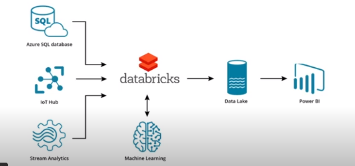

# Azure Databricks

## Table of Contents

- [Introduction](#introduction)
  - [Where Does Azure Databricks Fit?](#where-does-azure-databricks-fit)
- [Using Spark on Azure](#using-spark-on-azure)
  - [Creating a Databricks Workspace](#creating-a-databricks-workspace)
  - [Creating a Spark Cluster in Databricks](#creating-a-spark-cluster-in-databricks)
    - [Writing Spark Scripts in Databricks](#writing-spark-scripts-in-databricks)
    - [Creating a Notebook](#creating-a-notebook)

## Introduction 
Azure Databricks combines a range of data engineering technologies such as Apache Spark, Delta Lake, and MlFlow in a 
cloud-hosted environment that provides highly available, high performance data engineering within Microsoft Azure.

Databricks provides the technology stack to create solutions for data engineering, data analytics and data science use 
cases.

Benefits of using Azure Databricks include:
- Familiar languages and environment - Integrates with all Azure data products
- Everything’s in the cloud
- Easy to use for experiments, testing and development
- Connection to tons of data sources

### Where Does Azure Databricks Fit?

One possible solution involving Azure Databricks would utilize Databricks between a data lake and Azure Synapse or 
PowerBI.

In this scenario as an analytics platform,
- Azure data factory is used to ingest unstructured and structured data from business sources into Azure Data lake storage
- Azure Databricks is used to prepare, train, process, and transform data for use in Azure Synapse Analytics or Microsoft 
Power BI.

Another way to use Azure Databricks would be to utilize Databricks between data sources and a data lake. In this 
scenario:
- Databricks provides data flows and processing, and can even be used to prepare data for machine learning solutions.
- A variation of this use would pull the data lake back into Azure Databricks and use Delta Lake. This variation would 
implement the lakehouse architecture design.

## Using Spark on Azure

If you install Apache Spark on your desktop computer, there is an interactive shell that you can use to write code. An 
even easier way of writing code for Spark is to connect Jupyter Notebooks to it. This process can be complex when 
working on your local desktop computer, but in Azure Databricks, Jupyter Notebooks are built right in, and all of your 
work is done in the cloud.

Apache Spark compute power is available on-demand from Azure, and you can use as little or as much of this compute power 
as you need.

Within your Azure Databricks workspace, you can quickly and easily access Jupyter notebooks and begin writing code in 
Python, SQL, Scala, or R.

### Creating a Databricks Workspace
- From Azure portal Home space click on `Create a resource`
- There is a space for looking for resources: type 'azure databricks'
- Check that the right resource has been selected and press `create`
- That brings you to Azure Wizard for creating an Azure Databricks workspace. At the top of the Wizard you see the steps 
you need to walk through (Basics, Security, Networking...). 
- `Basics`:
  - you should have a subscription
  - `Resource group`: select the resource group you want to use
  - `Workspace name`: give your workspace a name
  - `Region`: select the region you want to use
  - `Pricing tier`: select the pricing tier you want to use (here Standard)
- We can leave the rest of the settings as default and go directly to the tab `Review + create`
- Click on `Create`

Once the resource is deployed: 
- we can use the `Go to resource` button to access the workspace.
- use the `Launch Workspace` button to access the workspace.
- On the left-hand side:
  - at the top we can choose the configuration for our Databricks
  - we can create additional notebooks, tables, clusters, or repo.
  - we can view our workspace
  - we can view our repos
  - we can view our data
  - our compute resources
  - our jobs

### Creating a Spark Cluster in Databricks
After choosing a name for your cluster, you choose the cluster mode based on the number of users and concurrency needs.

Next you will select a Databricks runtime version which determines which version of Scala and Spark are available.

You can also configure the autopilot options which allows you to turn off a cluster after a period of inactivity.

Next you configure the actual compute power to be used by configuring workers and driver type. The UI will provide an 
estimate of cost per hour so you can adjust according to your needs and budget.

Once configured, you create a cluster and after a period of time, it will be available to assign to Notebooks and Spark 
Jobs.

Azure Databricks provides a workspace where a data engineer can keep use Notebooks created in Jupyter and track data 
stored in Delta Lake.

The real power of Databricks comes from the Apache Spark compute power available on-demand from Azure.

To add and monitor the Apache Spark compute power associated with your workspace, you access the Computer node from the 
main Databricks workspace menu.
Here are the steps to create a cluster:
- From the Azure Databricks workspace, click on `Compute` on the left-hand side. This brings you to the compute tab 
where we can manage our clusters.
- Click on `Create Cluster`  or `Create compute` button to create a new cluster.
- `Cluster Name`: give your cluster a name
- Choose the `Cluster Mode`, (here we choose `Standard`)
- Choose the `Databricks Runtime Version` (here we choose `Runtime: 10.4 LTS (Scala 2.12, Spark 3.2.1`), this select 
- both the Scala and Spark version for the cluster.
- `Autopilot`: here we terminate after 10mn of inactivity and select `Enable autoscaling`.
- `Worker Type` (we choose `Standard_DS3_v2`), `Min workers` (choose 1), `Max workers` (choose 2)) determine the cost 
and the performance of the cluster. We can see the estimated cost per hour (DBU / hour).
- Click on `Create Cluster` (on the top of the screen) to create the cluster.

Once our Spark cluster has been created, we can return to the compute tab on the left-hand navigation to manage this 
resource.
- if you want to turn off your cluster manually:
  - click on the cluster name and use `Terminate` button to turn off the cluster.
  - It doesn't mean that the cluster is deleted, it just means that it is turned off and you're not being charged for it.
  
### Writing Spark Scripts in Databricks

Azure databricks has a native distributed file storage called Databricks File System or **DBFS** you can read and write 
from. An easy way to experiment and do developmental work is to upload files to DBFS through the workspace, and write 
data back to it. You can manage the DBFS through the workspace as well.

The DBFS also provides native table storage and a file format for Delta lake to use when developing a Delta lakehouse 
solution

Some useful functions for working with data within Databricks are read, write, and saveAsTable.
- Read: `spark.read.format`
- Write: `<dataframe>.write.format`. To write a file to Delta, and to overwrite in case there's already sata in: 
`df.write.format("delta").mode("overwrite").save("/delta/data")`
- Save Dataframe: `saveAsTable`: `df.write.format("delta").mode("overwrite").saveAsTable("datatable")`

By selecting the format of read, and write operations, files can be read from and written to the DBFS in various formats 
such as csv or to and from Delta Lake using the “delta” format.

Similarly, dataframes can be saved to Delta Lake simply by using the saveAsTable function and providing a table name for 
the data. 

#### Creating a Notebook
To start working with data in Databricks:
- Select `Workspace` from the left-hand navigation.
- Under `Shared`, clock on the down arrow select `Create` and then `Notebook`.
- Give it a name and select the language you want to use (here Python) and choose the cluster you want to use to run the
notebook.
- Now, any time you want to return to this notebook, you can select it from the left-hand navigation under `Workspace`,
`Shared`, and the name of the notebook.
- On the top of the screen, you can see the name of the cluster you are using. If the cluster is not running, you can
click on the `Start Cluster` button to start it.
- To confirm that data has been saved go to the `Data` tab on the left-hand navigation:
  - under the `Database Tables` section, you can see the table you created using the `saveAsTable` function.
  - under the `DBFS` section, you can see the file you created using the `save` function. These files are stored in the
  parquet format in the DBFS.
- **enable DBFS file browsing**: In order to be able to see the DBFS button at the top of the screen, you need to make a 
configuration change in your Azure Databricks workspace. To do this:
  - Go to `settings`, `admin console`, `Workspace settings`.
  - scroll to `Advanced` and find the setting named `DBFS file browser` and make sure it is set to `Enabled`.
  - refresh your browser for the change to take effect.