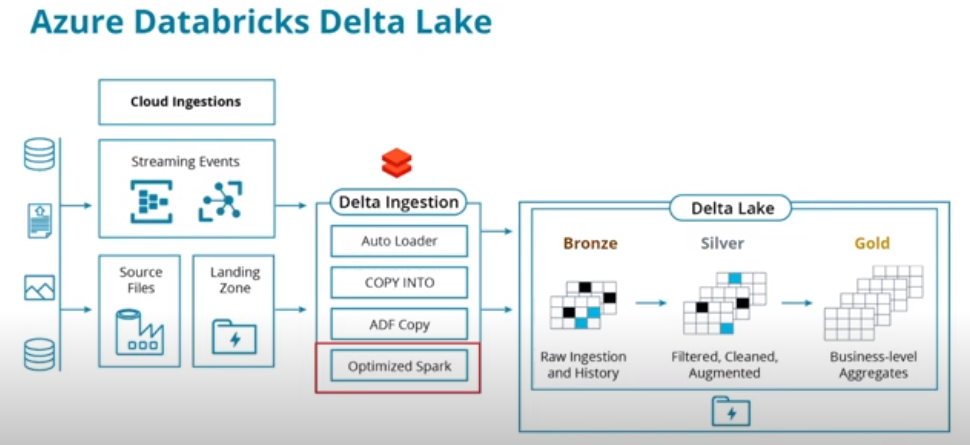

# Data Lakes and Lakehouse with Azure Databricks

## Table of Contents

## Introduction

Microsoft Azure has options for building both a traditional data lake as well as a modern lakehouse with databricks:
- **Building a data lake**: For a traditional data lake, Microsoft Azure offers Azure Data Lake Gen 2 which can handle 
multiple petabytes of information while providing hundreds of gigabits of throughput.
- **Building Lakehouse Architecture with Delta Lake in Azure Databricks**: For building lakehouse architecture, you 
should use Delta Lake in Azure Databricks. Delta Lake is comprised of data storage and the Delta engine. This 
architecture enables your organization to develop data engineering pipelines to ingest, process, and analyze large 
amounts of structured, semi-structured, and unstructured data while maintaining governance over your data.

### Data Lake and Lakehouse on Azure
Data lakes are an important tool for solving complex problems in larger organizations. Often these organizations have 
terabytes of data across many different data sources. This data may consist of typical SQL OLTP databases, geospatial 
databases, image data, and enterprise content management datastores containing files of all different types.

Data lakes provide solutions for organizations facing these types of challenges with managing and analyzing data of this 
scale and diversity.

Here's Microsoft's overview of [Lakehouse Architecture on Azure](https://techcommunity.microsoft.com/t5/analytics-on-azure-blog/simplify-your-lakehouse-architecture-with-azure-databricks-delta/ba-p/2027272).

## Azure Data Lake Gen 2

Microsoft [Azure Data Lake Gen2](https://docs.microsoft.com/en-us/azure/storage/blobs/data-lake-storage-introduction) is 
the second generation of Azure Data Lake.

Some of the key features of Azure Data Lake Gen 2 are:
- Incorporates and extends Azure Blob Storage.
- Hierarchical namespaces to enable the better organization of information
- The entire structure is accessible using Hadoop compatible APIs.

Azure Data Lake Gen 2 seamlessly integrates with other data engineering tools within Azure such as Azure Synapse, Azure 
Data Factory, and Azure Databricks. It provides a solid foundation for many common data engineering scenarios.

## Delta Lake using Azure Databricks



There are several tasks you need to understand in order to get started working with Delta Lake in Azure Databricks.
The entry to working with Delta Lake in Azure is through the Databricks workspace. Once you have created your workspace, 
you have access to Delta Lake. After you've created the Databricks workspace there are three more main tasks:
- Ingest data into delta lake
- Create and delete tables
- Read and write data both to and from files as well as to and from tables

To ingest data into Delta Lake, there are four ways:
- Auto Loader
- COPY INTO
- ADF Copy
- Optimized Spark scripts

We will focus on using Spark Scripts to ingest data from the DBFS into Delta tables. To use the Spark API to ingest data 
from the DBFS into Delta, first, we read the file in, in this case using the CSV file format. The statement reads 
directly from the DBFS filestore and creates a data frame, here named “df”.
```python
df = spark.read.format("csv") \
  .option("sep", ",") \
  .load("/FileStore/shared_uploads/data.csv") 
```
The next step is to write the data out using df.write. By setting the format to “delta” these data are saved into the 
Delta Lake at the location specified, in this case “/delta/data”.
```python
df.write \
  .format("delta") \
  .mode("overwrite") \
  .save("/delta/data")
```

### Uploading files to Delta using Databricks DBFS
- Within the Databricks workspace, on the left-hand side, click on the Data icon to open the Data tab.
- Initially, we can select `Databases` but we can't browse the DBFS from here. 
- To enable DBFS file browsing see [writing Spark scripts in Databricks](https://github.com/Geodego/data_engineering_azure/blob/master/3-data_lakes_and_lakehouses/4-azure_databricks.md#writing-spark-scripts-in-databricks).
- Now we have an option for database tables as well as DBFS.
- We are going to upload a file into `FileStore` in the DBFS.
- click on the `Upload` button on the top right hand side of the panel.
- Here we can add a location for our data (e.g. 'demo'). Now if I upload a file it will be placed in `FileStore/demo/data.csv`.

### Ingesting Data into Delta Lake
This method is useful for one time ingestion of data into the DBFS.

This is not the preferred method for setting up a data pipeline that needs to run regularly. For that, you should 
integrate other Azure tools such as Azure Data Factory or Azure Functions for getting data into Azure Databricks.

- Going back to the data tab, we can see in DBFS the `data.csv` file we uploaded.
- Go to `Workspace` from the left-hand navigation, under `Shared`, click on the down arrow and select `Create` and then
`Notebook`.
- check that you have a Spark cluster running.
- We'll read the file with the following code:
```python
df = spark.read.format("csv") \
    .option("inferSchema", "false") \
    .option("header", "true") \
    .option("sep", ",") \
    .load("/FileStore/demo/data.csv")
# make sure the data is loaded correctly
display(df)
```
- run the cell using `run cell` in the top right corner
- using the `+` sign at the bottom of our results, we can insert a new cell 
- To write the data to Delta, we use the following code:
```python
df.write.format("delta") \
  .mode("overwrite") \
  .save("/delta/data")
```
- run the cell to ingest the data from the csv file into the Delta Lake.
- using the left-hand navigation, go to the `Data` tab and select `DBFS`
- There is now a `delta` folder with a `data` folder inside it. This is where the data from the csv file is stored as 
a parquet file.
