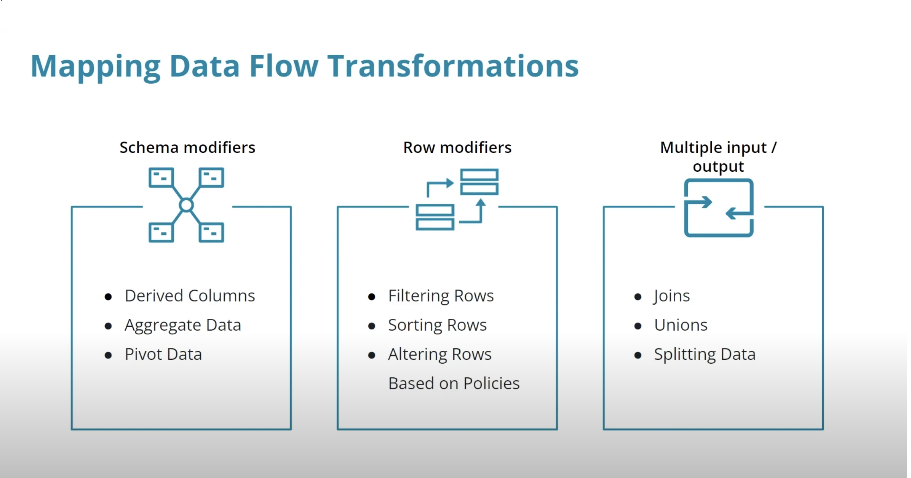
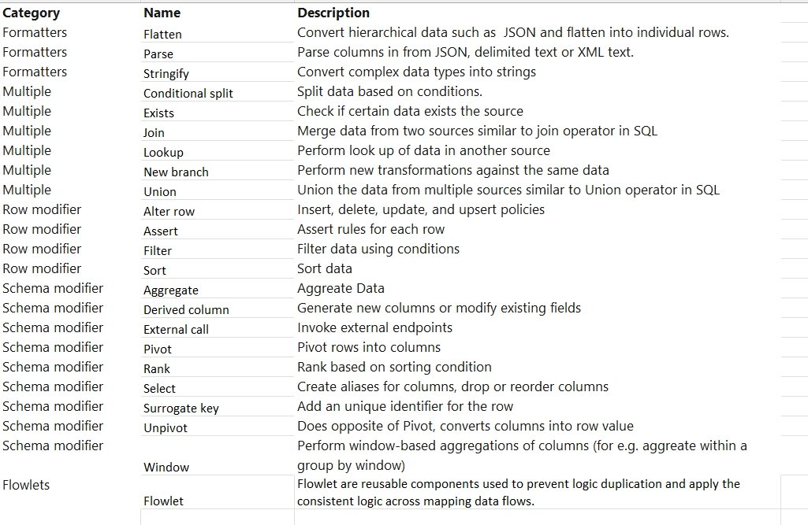

# Transforming Data in Azure Data Pipelines

## Table of Contents

## Introduction

Data pipelines contain transformation logic to manipulate data views. You can execute transformation logic such as:
- Filtering a row based upon a condition
- Combining data from two sources or streams
- Generating new columns or modify existing fields

This module will cover the following topics:
- Transform data in Azure Data Factory and Synapse Pipelines with Data Flows
- Debug, trigger, and monitor pipeline activities containing data flows
- Perform transformations programmatically using external compute
- Integrate Power Query in Azure Pipelines

## Mapping Data Flows

Mapping Data Flows are activities that perform the data extraction from the data stores and then transform and store the 
transformed data to the destination data store. These Data Flows are executed inside scaled-out Apache Spark clusters 
for limitless scale and performance.
The UI allows developers to create the Mapping Data Flows using drag and drop features without writing code. There are 
three types of transformations available in Mapping Data Flows:
- Schema modifiers: These transformations allow us to manipulate the data to create new derived columns based on calculations, aggregate data, or pivoting the data etc.
- Row modifiers: These transformations allow us to change rows for e.g. filtering rows, sort rows, alter row based on insert/update/delete/upsert policies.
- Multiple inputs/outputs: These transformations allow us to generate new data with joins, unions, or splitting the data.

Below are the various types of transformations:

### Expression Builder
Data Flows are integrated with the Visual Expression Builder in Azure Data Factory to perform transformation logic as simple expressions. The expression builder provides IntelliSense for highlighting, checking syntax, and also auto-completion.

Expressions are composed of columns from the input schema, functions, and parameters. All of these evaluate to Spark data types at runtime.
- Input Schema: References the columns from the input data source.
- Functions: Built-in functions that include array functions, aggregate functions, conversion functions, date and time functions, and window Functions etc.
- Parameters: Reference the parameters that are passed from the pipeline.
- Cached Lookup: Perform lookup in the data being processed in the activity.

### ex Mapping Data Flow in Azure Data Factory
- Select on the left `Author`
  - select the `...` near `Data Flows` and select `+ New Data Flow`
  - click on `add source` and give the source a name
  - in `data set` we need to select the relevant dataset
  - on order to be able to preview the data we need to activate `Data flow debug` on top of the screen
    - This will spin up a Spark cluster. Specify 2 hours if you plan to work that long.
    - click on `Debug settings` to specify the number of rows to preview
    - now you can select the header `data preview` to see the data
- Now we need to select the destination where we want to store the data
- click on the `+` near the activity (on the right of the large blue arrow) and select `sink`
  - give the sink a name
  - select the relevant dataset for that table in Synapse
  - You need to make sure the mappings are correct. If you see the `Auto Mapping` enabled, it means ADF
  will map the fields automatically. Sometimes if the data types are different then the auto mapping
  will not work. In that case you need to uncheck the `Auto Mapping` and map the fields manually.
  - Go to `Data Preview` to see how the data will look like in the destination.
  - Give a name to the data flow and click on `Publish All`
  

