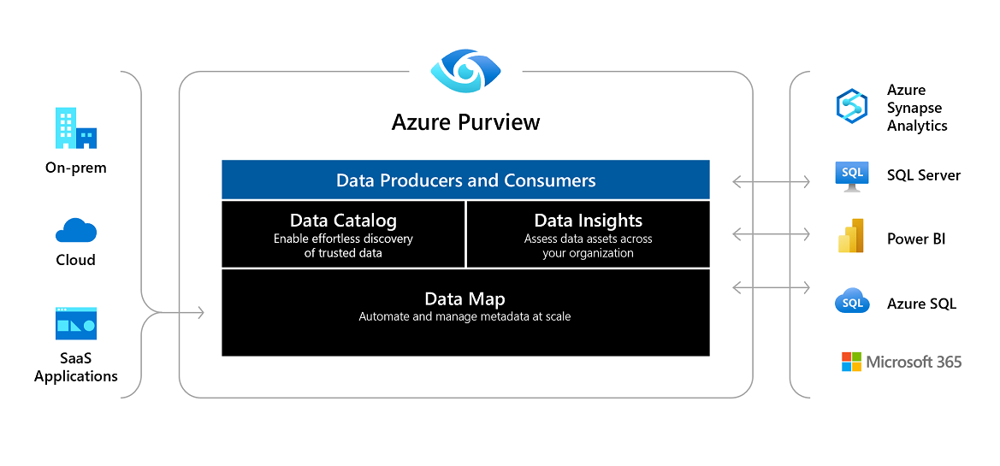

# Azure Pipeline Data Quality

## Table of Contents
- [Introduction](#introduction)
- [Optimizing Dataflows](#optimizing-dataflows)
  - [Tuning of the Integration Runtime](#tuning-of-the-integration-runtime)
  - [Partition Data During Transformation](#partition-data-during-transformation)
  - [Schema Drift](#schema-drift)
- [Slowly Changing Dimensions](#slowly-changing-dimensions)
- [Data Governance with Azure Purview](#data-governance-with-azure-purview)
  - [Demo Azure Purview](#demo-azure-purview)

## Introduction

Some areas of Data Governance and Data Quality overlap:
- Consistency: Data must be the same in multiple sources and destinations, or consistent.
- Selection, Cleansing: Data must be selected appropriately and cleansed so you know it’s fit for use.

Data cleansing, also known as data cleaning or data scrubbing, is the process of identifying, correcting, or removing 
inaccurate, incomplete, irrelevant, or corrupt data from a dataset.

Data Governance describes strategies for tracking data lineage through a system, knowing who it’s available to, and 
understanding the catalog of data available to the business. Data quality is a description of optimizing data so that it 
is complete, timely and consistent.

## Optimizing Dataflows

Azure infrastructure provides infrastructure to process and store the data at scale meaning you can process and store 
petabytes of data with lightning speeds. We need to follow certain best practices inside ADF or Synapse Workspace to 
achieve these limitless scale. There following are various techniques to achieve the optimization:

- **Tuning of the Integration Runtime**: The compute behind the Integration Runtime is based on Apache Spark it is usually 
takes around 3–4 minutes to spin off the cluster. If you have concurrent jobs running, it is recommended to set the 
desired value for the Time to Live value property on the Integration Runtime properties screen. This will keep the
cluster alive for the specified time and will not spin off the cluster for every job.
- **Partition data during transformation**: It is also advisable to partition the data for optimal processing of the data on 
the Spark clusters. The Optimize table in the Dataflow design screen provides options to desired partitioning technique:
    - Use Current Partition: this option is recommended when reading the data from Azure SQL DB as it enables parallel
    connections to extract the data more efficiently.
    - Single Partition: this option is recommended when reading the data from a small data source.
    - Set Partitioning Source. There are many partitioning techniques available in ADF and Synapse pipelines. The most
    common you might use are:
        - Hash: This technique is used to partition the data based on a hash function. Recommended for large FACT tables.
        - Round Robin: This technique evenly distributes the data across the partitions. Recommended for dimension tables.
- **Schema Drift**: Schema drift occurs when the columns in the source data changes after a Pipeline is developed and in use. 
It is very critical to handle these changes in the Pipelines for the data quality. This can be by enabling the 
"Allow schema drift" check box in the Data flows for the source as well sink data set.

Read this link for more details on schema drift:

[https://docs.microsoft.com/en-us/azure/data-factory/concepts-data-flow-schema-drift](https://docs.microsoft.com/en-us/azure/data-factory/concepts-data-flow-schema-drift)

Read this link for more optimization techniques:

[https://docs.microsoft.com/en-us/azure/data-factory/concepts-data-flow-performance](https://docs.microsoft.com/en-us/azure/data-factory/concepts-data-flow-performance)

## Slowly Changing Dimensions

A core building block of Datawarehouse is the data model built using modeling techniques such as Star Schema or 
Snowflake schema. These models typically consists of a Fact table that contains the metrics and Dimension tables that 
contain the descriptive information of the metrics. For example Dimension tables for a Sales Analytics application 
include Product, Customer, Time Period etc. As you can imagine, Dimensions values like Customer Phone, 
Customer address etc. change over time. These are called slowly changing dimensions(SCDs). It is very useful to store 
the historical data for the dimensions for reporting purposes and maintaining the efficient data quality.

There are 6 types of SCDs:
- Type 0: Ignore any changes and keep only the original values
- Type 1: Overwrite the existing values with new values
- Type 2: Add a new row with the new values and add a new version column that identifies current and prior version.
- Type 3: Add new columns for the new values. Like Current_Phone_Number and Original_Phone Number
- Type 4: Maintain all the historical values in a new History table.
- Type 5: This an extension of Type 4 where a mini-dimension table is created by maintaining the keys.
- Type 6: This is a combination of Type 1, Type 2 and Type 3. This adds a new record for new values and also maintains a 
new column.

Follow this link to learn more about the SCDs (which includes a recent addition of Hybrid SCD, Type 7 as well): 
[Slowly changind dimension](https://en.wikipedia.org/wiki/Slowly_changing_dimension)

Follow this link to an exercise on Slowly Changing Dimensions on Microsoft's Learn portal: 
[exercice](https://docs.microsoft.com/en-us/learn/modules/populate-slowly-changing-dimensions-azure-synapse-analytics-pipelines/4-exercise-design-implement-type-1-dimension)

## Data Governance with Azure Purview

Azure Purview is a data governance service on Azure to help organizations to empower its employees to discovery data 
quickly, classify data and as well as see the data lineage from source to destination. This is possible because Purview 
creates data map of data estate with the datasets and their relationships and stores the corresponding metadata.

Azure Data Factory and Synapse Workspace allow connection to Purview which automatically captures the lineage data.
[Azure purview overview](https://docs.microsoft.com/en-us/azure/purview/overview)

### Demo Azure Purview
The purpose of this demo is to connect Microsoft Purview to ADF and capture the data lineage when the pipeline is 
executed.
- In ADF select the `Manage` tab and click on `Azure Purview` and click on `Connect to a Purview Account`.
- Create a new Purview account if you don't have one (from the Azure Portal).
- click on `Apply`
- Once the connection is established, you can run the pipeline and check the lineage in the Purview account.
- Go to the Purview studio
- Click on `Browse the Assets` and select the collection.
- Purview has automatically captured all the sources and targets from ADF.
- You can click on one of them to see the lineage.