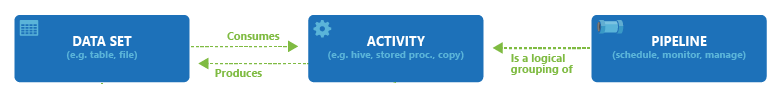
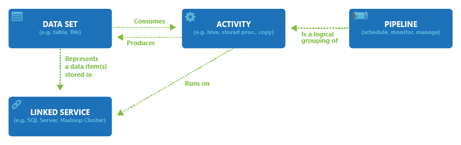

# Azure Data Pipeline Components

## Table of Contents

- [Expert Perspective: Data Pipelines](#expert-perspective-data-pipelines)
- [Pipelines and Activities](#pipelines-and-activities)
- [Creating Azure Resources](#creating-azure-resources)
  - [Creating an Azure SQL Database resource](#creating-an-azure-sql-database-resource)
  - [Creating an Azure Data Lake Gen2 resource](#creating-an-azure-data-lake-gen2-resource)
  - [Creating an Azure Data Factory resource](#creating-an-azure-data-factory-resource)
- [Pipeline Component: Linked Services](#pipeline-component-linked-services)
  - [Creating a Linked Service](#creating-a-linked-service)
- [Pipeline Components: Datasets](#pipeline-components-datasets)
  - [Creating a Dataset](#creating-a-dataset)

## Expert Perspective: Data Pipelines

Organizations have been accumulating vast amounts of structured and unstructured data throughout their processes to 
analyze and optimize the process with data analytics. This helps meet various objectives such as cost savings, 
generating more revenues, developing new products, and improving customer satisfaction.

As organizations migrate more data workloads to Cloud platforms such as Azure, the need for automated and scalable petabyte-scale 
data movement and transformation is crucial for faster decision-making with the data. The right answer for this 
challenge is to leverage Azure Data Factory or Azure Synapse Pipelines.

Azure Data Factory or Azure Synapse Pipelines provide cloud-based code-free ETL (or ELT) as a service to orchestrate the 
data movement between 100s of data sources at petabyte scale.

## Pipelines and Activities

Pipeline in Azure Data Factory or Synapse are logical grouping of various activities such as data movement, data 
transformation and control flow. The Activities inside the Pipelines are actions that we perform on the data. For 
example:
- Copy data activity is used to load data from on-prem SQL server to Azure Data Lake
- Dataflow activity to extract data from Data Lake, transform and load into Synapse
- Control Flow activity to iteratively perform the copy data activities or data flow activities

[The relationship between pipelines, activities and datasets](https://docs.microsoft.com/en-us/azure/data-factory/concepts-pipelines-activities?tabs=data-factory):

## Creating Azure Resources

### Creating an Azure SQL Database resource
see [Azure SQL Database](https://github.com/Geodego/data_engineering_azure/blob/master/2-data_warehouses/6-Azure_tools_configuration.md#azure-sql-database)
For requesting the database select on the left `Query editor (preview)`
### Creating an Azure Data Lake Gen2 resource
see [Azure Data Lake Gen2](https://github.com/Geodego/data_engineering_azure/blob/master/2-data_warehouses/6-Azure_tools_configuration.md#azure-blob-storage)

In the `Advanced` tab and enable the `hierarchy namespace` feature. That will make the Storage account a Data Lake Gen2.

### Creating an Azure Data Factory resource
- From Azure portal Home space click on `Create a resource`
- Select `Data Factory` from the list of resources
- Click on `Create`
- This brings you to the 'Create data factory' wizard.
- `Basics`:
  - `Resource group`: select the resource group you want to use
  - `name`: The name has to be unique
  - select the region
  - keep the version 2 of the ADF
- `Git Configuration`:
  - check the box `Configure Git later`
- We can leave the rest of the settings as default and go directly to the tab `Review + create`
- Click on `Create`

To use the Azure Data Factory, click on `Open ` 

### Create Synapse Analytics Workspace
see [Azure Data Lake Gen2](https://github.com/Geodego/data_engineering_azure/blob/master/2-data_warehouses/6-Azure_tools_configuration.md#Azure-Synapse)

## Pipeline Component: Linked Services 
A Linked Service is a pipeline component that contains the connection information needed to connect to a data source.

For example in order to connect to a SQL Server database, you will need the server name, a user name and password.

The Linked Service is the first building block in the process, so it has to be created before creating any other 
pipeline components.

ADF and Synapse provide connectors to 100 plus data sources under the following categories:
- Azure: Azure Blob Storage, Azure Search, Azure Synapse, Azure SQL DB, Cosmos DB etc.
- External Databases: Amazon Redshift, Google Big Query, SQL Server on-prem, Oracle, SAP etc.
- File: Amazon S3, Google Cloud Storage, FTP etc.
- Generic Protocol: ODBC, OData, REST, Sharepoint Online List etc.
- NoSQL: MongodB, Cassandra, Couchbase
- Services and Apps: Dynamics 365, Concur, AWS Web Service, Salesforce, Snowflake etc.

### Creating a Linked Service
- click on the `Manage` tab
- click on `Linked Services`
- click on `+ New`
- select the type of linked service you want to create (Azure SQl database or Azure Synapse Analytics for example)
- Give the linked service a name, for example, `ls_sqlserver`

For Azure SQL Database:
- give a name to the linked service, eg. `ls_dbsales`
- select the `Azure SQL Database` option
- select the Azure Subscription
- select the SQL Server name
- select the database name
- use the `SQL authentication` option, to give the username and password
- click on `test connection` to verify the connection
- make sure the IP address of the machine you are using is added to the firewall rules of the SQL Server
- when the connection is successful click on `create`

For storage account that will be used as a staging folder:
- select the `Azure Data Lake Storage Gen2` option
- give a name to the linked service, eg. `ls_sa`
- select the Azure Subscription
- select the storage account name
- click on `test connection` to verify the connection
- when the connection is successful click on `create`

## Pipeline Components: Datasets

While the Linked Service gives you the ability to connect to the data source, Datasets allow you to create a view of 
data source objects such as database tables and files on Data Lake. You need the datasets for every source object to 
extract the data and every target object to store the data.

### Creating a Dataset
- click on the `Author` tab
- click on `...` next to `datasets`
- click on `New dataset`
- select the type of dataset you want to create (Azure SQl database or Azure Synapse Analytics for example)
- `name`: for example, ds_salesorderheader
- `Linked service`: select the linked service you created earlier
- `Table name`: select the table you want to use
- keep the default option for the `import schema` option
- click on `publish all` to save the datasets

## Integration Runtimes

The Integration Runtime(IR) is the compute leveraged to perform all the data integration activities in ADF or Synapse 
Pipelines. These activities include:
- Data Flow: Execute a Data Flow in the compute environment.
- Data movement: Copy data across data stores in a public or private networks
- Activity dispatch: Dispatch and monitor transformation activities running on external platforms such as SQL Server, Azure Databricks etc.
- SSIS package execution: Execute legacy SQL Server Integration Services (SSIS) packages.

Types of Integration Runtimes:

You are allowed to create three different types of Integration types as explained below:
- Azure IR: Perform data flows, data movement between cloud data stores. It can also be used to dispatch activities to 
external compute such as Databricks, .NET activity, SQL Server Stored Procedure etc. that are in public network or using 
private network link. Azure IR is fully managed, serverless compute.
- Self-hosted IR (SHIR): SHIR is used to perform data movement between a cloud data stores and a data store in private 
network. It can also be used to dispatch activities to external computes on-premises or Azure Virtual Network. These 
computes include HDInsight Hive, SQL Server Stored Procedure activity etc.
- Azure-SSIS IR: This is used to lift and shift the existing SSIS packages to execute in Azure.

Integration Runtime Location:

It is important to learn how the location of the IR operates. When you create an IR in a region, it stores the metadata 
in that region and triggers the pipelines in that region.

The pipelines can access data stores from other regions for data movement because we create linked services to those 
data stores.

[More about Integration Runtimes](https://docs.microsoft.com/en-us/azure/data-factory/concepts-integration-runtime)

### Creating an Integration Runtime
In ADF there is an existing Integration Runtime called "AutoResolveIntegrationRuntime" that is used to run the pipelines.
You can also create a new Integration Runtime for your ADF within in the same region as your Resource Group.
- Login to ADF and verify that there is already an existing Integration Runtime called "AutoResolveIntegrationRuntime" 
under Manage-> Integration Runtimes
- Create a new Integration Runtime for your ADF within in the same region as your Resource Group
  - click on `+ New` 
  - click on `Azure` and give it a name
  - Instead of selecting the `Auto Resolve` option we want to select a region 
  - under `Data flow runtime` you need to select the ideal `Time to live`, if there are no workloads running for a
    certain amount of time the IR will be automatically stopped