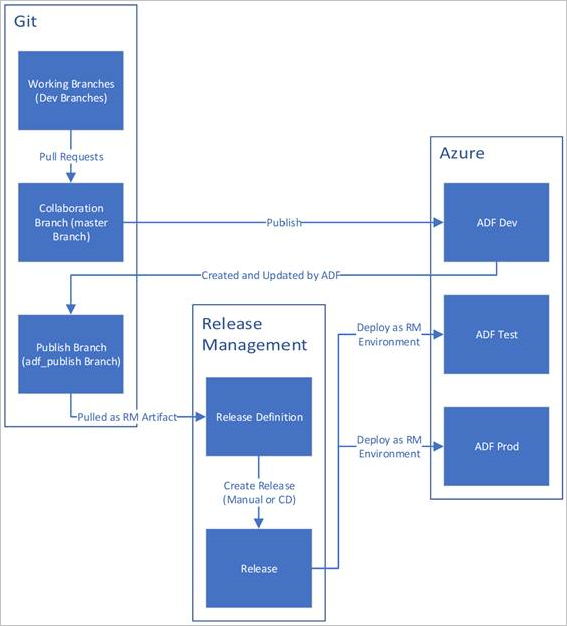
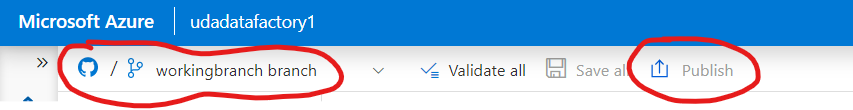

# Azure Data Pipelines in Production

## Table of Contents

- [Introduction](#introduction)
- [Parameterizing Pipelines](#parameterizing-pipelines)
  - [Method for adding parameters to a dataflow](#method-for-adding-parameters-to-a-dataflow)
- [Creating ADF Objects Programmatically](#creating-adf-objects-programmatically)
  - [Method for creating ADF Objects with Azure CLI](#method-for-creating-adf-objects-with-azure-cli)
- [Pipeline Continuous Integration and Delivery](#pipeline-continuous-integration-and-delivery)
  - [Steps to integrate ADF with DevOps](#steps-to-integrate-adf-with-devops)

## Introduction
After you build your data pipelines, you’ll need to consider how they’ll be used in production:
- How will you set values for database names or credentials in a reusable way?
- How will you make changes to them, release those changes, and automate the releases?
In order to achieve these production requirements, you’ll need to turn your data pipelines and components into reusable 
- code.

This part takes a look at some ways to build parameters into your pipelines and integrate them into 
continuous integration and delivery processes.

The points covered in this part are:
- How to add parameters to your pipelines.
- How to create pipelines programmatically.
- Use the Azure CLI.
- JSON representations of a pipeline to put under source control in Github or Azure DevOps.
- How to publish your pipelines to Github and Azure DevOps
- Workflow with pipelines in a continuous integration and delivery environment.

## Parameterizing Pipelines
Re-usability of code or any objects is highly important in the modern IT world. It helps to accelerate the overall 
deployment process with scale, cost savings and maintain the quality of the overall integration and deployment process. 
Azure Data Factory and Synapse Pipelines provide parameterization to speed up the Data Integration, data transformation 
process to speed up the implementation and to reduce the costs of the implementation. Parameters are supported by 
pipelines, datasets, linked services and data flows.


Examples of parameters in Azure Data Factory or Synapse Workspace:
- Parameterize can be created inside linked services to pass dynamic values for database, username etc. This useful to 
connect to different databases(for e.g. Dev, QA, UAT etc.) in a same logical SQL server by passing the passing database 
name dynamically instead of creating linked service for each database.
- Pipeline Parameters: Define parameters inside the Pipelines and Data Flows and use inside the expressions activities 
from data extraction to sink. When the Data Flows are executed inside the Pipelines, the parameters can be passed from 
Pipelines to data flows.
- Global parameters are global in the data factory environment, meaning they can be utilized by all pipelines and can be 
passed to data flows. Global parameters are very useful when promoting to Dev, QA, UAT or Prod environments. Note: 
Global Parameters are not yet available inside Synapse workspace.
- System Variables: Azure Data Factory and Synapse Workspace provide System Variables. Example system variables, 
`@pipeline().DataFactory, @pipeline().RunId, @trigger().startTime`

### Method for adding parameters to a dataflow

- select the dataflow
- select `Parameters` and click on `+ New`
- Select the part of the pipeline using that parameter (e.g. filter). Using the `Parameters` section of `Expression 
elements you can build an expression using the parameter (e.g. `CustomerID != $df_param_custid`).

Now you can create a pipeline that uses the dataflow and pass the parameter to the dataflow:
- Create a new pipeline
- Add the dataflow to the pipeline
- select the integration runtime
- select a staging folder and select a container
- create another parameter at the pipeline level
- select `Parameters` and click on `+ New`
- we need to pass the pipeline parameter to the dataflow: 
  - select the dataflow
  - select `Parameters` and select the parameter. In value select `Pipeline expression`. You'll see various options.
  - select the `Parmeters` tab and select the parameter you want to pass to the dataflow. On the top of the screen you'll
  see the expression: `@pipeline().parameters.pf_param_custid`
  - click ok and publish the pipeline
  - click on `Trigger now`. Notice the pipeline is asking for a parameter.
  
You can also set the global parameters in the `Manage` section of ADF. These global parameters are available to all the
data pipelines.
You can create the parameters to the linked services as well. While executing any connection from the linked service, it 
will ask you to enter the parameters.

## Creating ADF Objects Programmatically

While it is easy to create Pipelines and Activities in ADF Studio UI (or on Azure in general), it useful to create the 
objects programmatically to efficiently and iteratively automate the creation or deployment of the resources between Dev, 
QA and Prod or other Azure resource groups.

ADF or Synapse Pipeline create JSON scripts for all the objects. We can then use similar JSON scripts to 
programmatically create objects. ADF and Synapse Analytics support the following methods to create objects:
- Azure Command Line Interface(CLI): [Azure CLI](https://docs.microsoft.com/en-us/azure/data-factory/quickstart-create-data-factory-azure-cli)
- Azure Powershell: [Powershell](https://docs.microsoft.com/en-us/azure/data-factory/quickstart-create-data-factory-powershell)
- .NET SDK:[.Net sdk](https://docs.microsoft.com/en-us/azure/data-factory/quickstart-create-data-factory-dot-net)
- Python: [Python](https://docs.microsoft.com/en-us/azure/data-factory/quickstart-create-data-factory-python)
- REST: [REST](https://docs.microsoft.com/en-us/azure/data-factory/quickstart-create-data-factory-rest-api)
- ARM Templates: [ARM Templates](https://docs.microsoft.com/en-us/azure/data-factory/quickstart-create-data-factory-resource-manager-template

Additional Resources
If you want to learn more about creating ADF objects programmatically, we recommend referring the following Microsoft resources
- [create data factory azure cli](https://docs.microsoft.com/en-us/azure/data-factory/quickstart-create-data-factory-azure-cli)
- [create data factory python](https://docs.microsoft.com/en-us/azure/data-factory/quickstart-create-data-factory-python)

### Method for creating ADF Objects with Azure CLI
The objective is to create an Azure Data Factory using the command line script.
- In azure portal go to Cloud Shell. When you connect to the cloud shell the first time, it might ask you to create a 
temporary storage account and file system.
- Type the following command to create a new data factory:
```bash
az datafactory create --factory-name <data-factory-name> --resource-group <resource-group-name> 
```
you can also create all the ADF components like linked services, datasets, but you'll have to pass additional parameters
to the command like JSON files.
ADF or synapse pipeline creates the json scripts for every object. On the right of the name of the object click on the
flow brackets `{}` to see the JSON script.

## Pipeline Continuous Integration and Delivery

Continuous Integration(CI) and Continuous Delivery(CD) is a DevOps process of iteratively developing or changing the 
code or ADF Pipelines and promoting to target environments. This is possible by integrating the Azure Data Factory or 
Synapse Workspace with Azure DevOps or Github. You can also use the ARM (Azure Ressource Management) templates to 
promote the Pipelines to target environments.

[Typical CI/CD process:](https://docs.microsoft.com/en-us/azure/data-factory/continuous-integration-delivery)



### Steps to integrate ADF with DevOps

Purpose is to link a DevOps repo and publish all your ADF or Synapse objects into the repo.



- Login to your preferred DevOps repo environment like Azure DevOps or Github. If you choose Azure DevOps then you need
to go to the Azure DevOps portal and create a project.
- Create a source repository where you need the objects to be stored. Note: Github calls it as Repositories
- In ADF, `Manage` tab then `Git configuration`, Configuration and link the repo by following the instructions.
- Notice in the ADF bar, the repo branch that will be used to store your objects and a Publish button. The name of the
branch replaces the standard `Data Factory` name. This is the branch where you will publish your work.
- Go to the `Author` tab, every thing you see here, datasets, pipelines, linked services, dataz flows will be published
- Click on Publish to publish the objects into the repo. If the Publish button is greyed out then all recent changes are 
published.
- Login to your DevOps environment and verify that the objects are published.
- At this point you can work with DevOps engineer in your organization to create the DevOps pipelines to perform the 
migrations to QA or Prod environments.

If you would like to perform the migrations yourself then you can find the remaining DevOps steps under this link:
[operationalize ADF pipelines](https://docs.microsoft.com/en-us/learn/modules/operationalize-azure-data-factory-pipelines/)