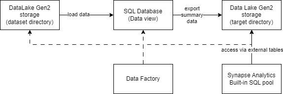

# Project: Data Integration Pipelines for NYC Payroll Data Analytics

## Project Overview

The City of New York would like to develop a Data Analytics platform on Azure Synapse Analytics to accomplish two
primary objectives:

- Analyze how the City's financial resources are allocated and how much of the City's budget is being devoted to
  overtime.
- Make the data available to the interested public to show how the City’s budget is being spent on salary and overtime
  pay for all municipal employees.

As a Data Engineer, you should create high-quality data pipelines that are dynamic, can be automated, and monitored for
efficient operation. The project team also includes the city’s quality assurance experts who will test the pipelines to
find any errors and improve overall data quality.

The source data resides in Azure Data Lake and needs to be processed in a NYC data warehouse. The source datasets
consist of CSV files with Employee master data and monthly payroll data entered by various City agencies.


We will be using Azure Data Factory to create Data views in Azure SQL DB from the source data files in DataLake Gen2.
Then we built our dataflows and pipelines to create payroll aggregated data that will be exported to a target directory
in DataLake Gen2 storage over which Synapse Analytics external table is built. At a high level your pipeline will look
like below:



## Project Environment

For this project, you'll do your work in the Azure Portal, using several Azure resources including:

- Azure Data Lake Gen2 (Storage account with Hierarchical Namespaces checkbox checked when creating)
- Azure SQL DB
- Azure Data Factory
- Azure Synapse Analytics

You'll also need to create a Github repository for this project. At the end of the project, you will connect your Azure
pipelines to Github and submit the URL or contents of the repository.

## Project Data

[Download these .csv files](https://video.udacity-data.com/topher/2022/May/6283aff5_data-nyc-payroll/data-nyc-payroll.zip)
that provide the data for the project.

## Instructions

### Task 1: Create and Configure Resources

#### Create the data lake and upload data

- Create an Azure Data Lake Storage Gen2 (storage account, we call it `uproject4`) and associated storage container
  resource named `adlsnycpayroll-yourfirstname-lastintial`.
- In the Azure Data Lake Gen2 creation flow, go to Advanced tab and ensure below options are checked:
    - Require secure transfer for REST API operations
    - Allow enabling anonymous access on individual containers
    - Enable storage account key access
    - Default to Microsoft Entra authorization in the Azure portal
    - Enable hierarchical namespace
- Create three directories in this storage container named:
    - dirpayrollfiles
    - dirhistoryfiles
    - dirstaging. `dirstaging` will be used by the pipelines we will create as part of the project to store staging data
      for
      integration with Azure Synapse.
- Upload the data files provided in the project data section to:
    - dirpayrollfiles for EmpMaster.csv, AgencyMaster.csv, TitleMaster.csv and nycpayroll_2021.csv
    - dirhistoryfiles for nycpayroll_2020.csv (historical data)

#### Create Azure Data Factory resource

- Create an Azure Data Factory resource

#### Create Azure SQL DB resource and tables

- Create an Azure SQL DB resource named `db_nycpayroll`:
    - In the creation steps, you will be required to create a SQL server, create a server with Service tier: Basic
    - In Networking tab, allow both of the below options:
        - Allow Azure services and resources to access this server
        - Add current client IP address
- Create Employee Master Data table:
  ```sql
    CREATE TABLE [dbo].[NYC_Payroll_EMP_MD](
    [EmployeeID] [varchar](10) NULL,
    [LastName] [varchar](20) NULL,
    [FirstName] [varchar](20) NULL
    ) 
    GO
    ```
- Create Job Title table:
  ```sql
    CREATE TABLE [dbo].[NYC_Payroll_TITLE_MD](
    [TitleCode] [varchar](10) NULL,
    [TitleDescription] [varchar](100) NULL
    )
    GO
  ```
- Create Agency Master Data table:
  ```sql
    CREATE TABLE [dbo].[NYC_Payroll_AGENCY_MD](
    [AgencyID] [varchar](10) NULL,
    [AgencyName] [varchar](50) NULL
    )
    GO
    ```
- Create Payroll 2020 transaction data table:
    ```sql
    CREATE TABLE [dbo].[NYC_Payroll_Data_2020](
        [FiscalYear] [int] NULL,
        [PayrollNumber] [int] NULL,
        [AgencyID] [varchar](10) NULL,
        [AgencyName] [varchar](50) NULL,
        [EmployeeID] [varchar](10) NULL,
        [LastName] [varchar](20) NULL,
        [FirstName] [varchar](20) NULL,
        [AgencyStartDate] [date] NULL,
        [WorkLocationBorough] [varchar](50) NULL,
        [TitleCode] [varchar](10) NULL,
        [TitleDescription] [varchar](100) NULL,
        [LeaveStatusasofJune30] [varchar](50) NULL,
        [BaseSalary] [float] NULL,
        [PayBasis] [varchar](50) NULL,
        [RegularHours] [float] NULL,
        [RegularGrossPaid] [float] NULL,
        [OTHours] [float] NULL,
        [TotalOTPaid] [float] NULL,
        [TotalOtherPay] [float] NULL
    ) 
    GO
    ```
- Create Payroll 2021 transaction data table:
    ```sql
     CREATE TABLE [dbo].[NYC_Payroll_Data_2021](
        [FiscalYear] [int] NULL,
        [PayrollNumber] [int] NULL,
        [AgencyCode] [varchar](10) NULL,
        [AgencyName] [varchar](50) NULL,
        [EmployeeID] [varchar](10) NULL,
        [LastName] [varchar](20) NULL,
        [FirstName] [varchar](20) NULL,
        [AgencyStartDate] [date] NULL,
        [WorkLocationBorough] [varchar](50) NULL,
        [TitleCode] [varchar](10) NULL,
        [TitleDescription] [varchar](100) NULL,
        [LeaveStatusasofJune30] [varchar](50) NULL,
        [BaseSalary] [float] NULL,
        [PayBasis] [varchar](50) NULL,
        [RegularHours] [float] NULL,
        [RegularGrossPaid] [float] NULL,
        [OTHours] [float] NULL,
        [TotalOTPaid] [float] NULL,
        [TotalOtherPay] [float] NULL
    ) 
    GO
    ```
- Create Payroll Summary table:
    ```sql
    CREATE TABLE [dbo].[NYC_Payroll_Summary](
        [FiscalYear] [int] NULL,
        [AgencyName] [varchar](50) NULL,
        [TotalPaid] [float] NULL 
    )
    GO
    ```

#### Create Synapse Analytics Workspace

- Create a Synapse Analytics workspace, or use one you already have created.
- Under Synapse, you will not be allowed to run SQL commands in the default main database. Use the below command to
  create a database and then refresh the database selector dropdown and choose your created database before running
  any queries:
  ```sql
  CREATE DATABASE udacity
  ```
    - You are only allowed one Synapse Analytics workspace per Azure account, a Microsoft restriction.
    - Create a new Azure Data Lake Gen2 and file system for Synapse Analytics when you are creating the Synapse
      Analytics
      workspace in the Azure portal.
    - Define the file format, if not already, for reading/saving the data from/to a comma delimited file in blob
      storage:
      ```sql
      -- Use the same file format as used for creating the External Tables during the LOAD step.
      IF NOT EXISTS (SELECT * FROM sys.external_file_formats WHERE name = 'SynapseDelimitedTextFormat') 
      CREATE EXTERNAL FILE FORMAT [SynapseDelimitedTextFormat] 
      WITH ( FORMAT_TYPE = DELIMITEDTEXT ,
      FORMAT_OPTIONS (
      FIELD_TERMINATOR = ',',
      USE_TYPE_DEFAULT = FALSE
      ))
      GO
      ```
    - Define the data source to persist the results. Use the blob storage account name as applicable to you. The data
      source to use is the folder `dirstaging` defined previously.
      ```sql
      -- Use the same data source as used for creating the External Tables during the LOAD step.
      IF NOT EXISTS (SELECT * FROM sys.external_data_sources WHERE name = '<adlsnycpayroll-yourfirstname-lastintial>_uproject4_dfs_core_windows_net') 
      CREATE EXTERNAL DATA SOURCE [<adlsnycpayroll-yourfirstname-lastintial>_uproject4_dfs_core_windows_net] 
      WITH ( 
          LOCATION = 'abfss://uproject4@<adlsnycpayroll-yourfirstname-lastintial>.dfs.core.windows.net/dirstaging' 
      )
      GO
      ```
    - Create external table that references the `dirstaging` directory of DataLake Gen2 storage for staging payroll
      summary data:
      ```sql
      CREATE EXTERNAL TABLE [dbo].[NYC_Payroll_Summary](
      [FiscalYear] [int] NULL,
      [AgencyName] [varchar](50) NULL,
      [TotalPaid] [float] NULL
      )
      WITH (
      LOCATION = '/',
      DATA_SOURCE = [<adlsnycpayroll-yourfirstname-lastintial>_uproject4_dfs_core_windows_net],
      FILE_FORMAT = [SynapseDelimitedTextFormat]
      )
      GO
        ```
      the data will be stored in the ‘/’ directory in the blob storage in dirstaging (this was configured when creating
      datasource). You can change the location as you desire. Also, change the DATA_SOURCE value, as applicable to you.
      Note that, `uproject4` is the Data Lake Gen 2 storage name, and `<adlsnycpayroll-yourfirstname-lastintial>` is the
      name of the file system (container).

#### Check list

- Created an Azure Data Lake Gen2 storage account with folders, and uploaded .csv files to folders.
- Created Azure Data Factory Resource
- Created SQL DB resource and tables
- Created Synapse Analytics Workspace
- Capture screenshot of the below
  - DataLakeGen2 that shows files are uploaded 
  - Above 5 tables created in SQL db 
  - External table created in Synapse


### Task 2: Create Linked Services 

#### Create Linked Services in Azure Data Lake
In Azure Data Factory, create a linked service to the data lake that contains the data files:
- From the data stores, select Azure Data Lake Gen 2
- Test the connection

#### Create Linked Services in Azure SQL DB
- Create a Linked Service to SQL Database that has the current (2021) data
- If you get a connection error, remember to add the IP address to the firewall settings in SQL DB in the Azure Portal

#### Check list
- Capture screenshot of Linked Services page after successful creation
- Save configs of Linked Services after creation (How!)
