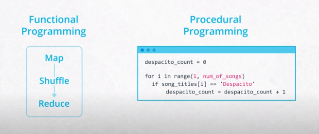
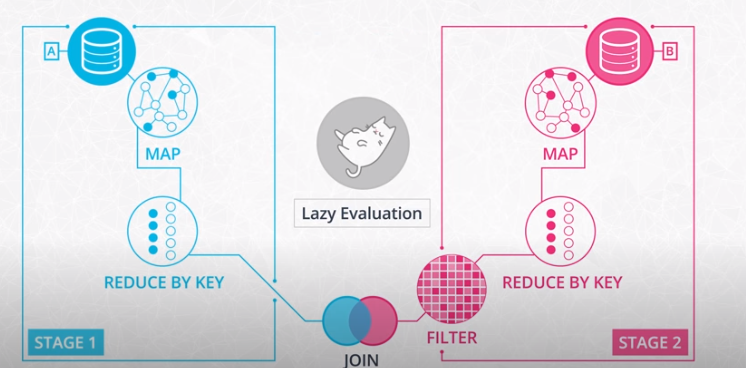

# Data Wrangling with Spark

## Table of Contents

## Functional Programming

### Introduction

One of the hardest parts of learning Spark is becoming familiar with the functional style of programming. Under the 
hood, Spark is written in a functional programming language called Scala.
- When you're programming with functional languages, you end up solving problems in a pretty different way than you would 
if you're using a general purpose language like Python.
- Although Spark is written in Scala, you can use it with other languages like Java, R, and even Python. 

Even when you're using the PySpark API, you'll see the functional programming influence of Scala. For example, in 
the last lesson, you saw a MapReduce problem that counted up the number of times a song was played.
- This code went through each record and spit out a tuple with the name of the song, and the number one.
- The tuples were shuffled and reduced to a sum of the ones that came with each song name.

If you're used to counting with For Loops and found that logic a little strange, it's because this was a functional 
approach to summing up songs

In the procedural style, you'd use a counter variable to keep track of the play count for each song. Then you'd iterate 
through all the songs, and increment the counter by one if the song name matched.

### Why use functional programming?

The core reason Spark uses functional programming is that functional programming is perfect for distributed systems.
- Functional programming helps minimize mistakes that can cripple an entire distributed system.
- Functional programming gets its name from the functions you saw in your algebra class. These functions are stricter 
than your average Python function because in math a function can only give you one answer when you give it an input. 
On the other hand, Python allows you to make some flexible, albeit complex, functions that depend on the input and 
other parameters.
- When you evaluate a mathematical function, you would never change the inputs of that function, but this is exactly 
what can happen in Python.

### Procedural Programming example
Consider a scenario where executing code updates a global variable to track the play count of a song. Running this code multiple times could yield varied outcomes. This illustrates a fundamental challenge:
- Identifying issues becomes straightforward in such a singular example. However, the complexity escalates when numerous 
machines execute code concurrently, especially if recalculations are necessary due to occasional problems with any of 
the machines.
- In the context of Python programming, the term "function" is frequently used to describe any code following a `def` 
keyword. However, a more precise terminology would differentiate between methods or procedures and true functions, 
indicating that what we often call functions may not adhere to the strict definition of pure functions.

### Pure functions analogy
Imagine your program is like a bread factory, and your function is a specific machine in your factory that makes 
sourdough bread. But since your factory needs to mass-produce bread at a large scale, you need to be a bit more careful.

One thing you'll need to avoid when designing your bread-maker is unintended side effects.
- After each loaf, your machine needs to leave the factory exactly the same as before it ran.
- If you don't, each machine could start interfering with the others.

For example, if running a single bread-maker made the entire factory one degree warmer, then running several of these 
machines all at once would start to heat up the room.

In distributed systems, your functions shouldn't have side effects on variables outside their scope, since this could 
interfere with other functions running on your cluster.
- Your bread making machine needs to get the ingredients without ruining them since other breadmakers will also need them.
- In distributed systems, you also need to be careful with how you design your functions. Whenever your functions run 
on some input data, it can alter it in the process. If your bread-making machine protects the input ingredients and 
doesn't cause any side effects, then you have a smooth and clean operation.

If you write functions that **preserve their inputs** and **avoid side effects**, these are called **pure functions**, 
and your spark code will work well at the scale of big data.

### Spark DAGs
Every Spark function makes a copy of its input data and never changes the original parent data. Because Spark doesn't 
change or mutate the input data, it's known as **immutable**. This makes sense when you have a single function. But what 
happens when you have lots of functions in your program?
- In Spark, you do this by chaining together multiple functions that each accomplish a small chunk of the work.
- You'll often see a function that is composed of multiple sub-functions
- In order for this big function to be peer, each sub function also has to be peer.

If seems that Spark would need to make a copy of the input data for each subfunction. If this was the case your Spark 
program would run out of memory pretty quickly. To avoid this issue, Spark uses a functional programming concept 
called **lazy evaluation**. Before Spark does anything with the data in your program, it first built step-by-step 
directions of what functions and data it will need. In Spark, this is called a **Directed Acyclic Graph (DAG)**. 
Once Spark builds the DAG from your code, it checks if it can procrastinate, waiting until the last possible moment to 
get the data. In Spark, these multi-step combos are called **stages**.

