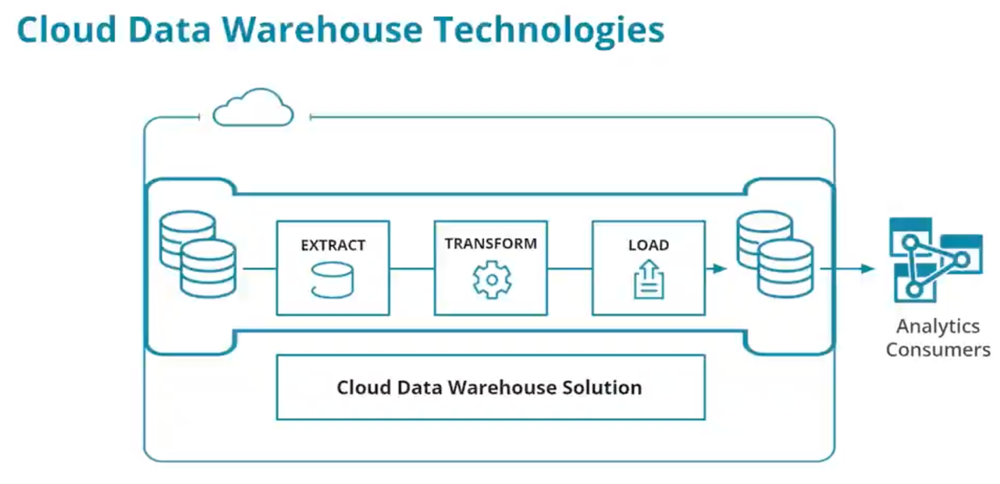
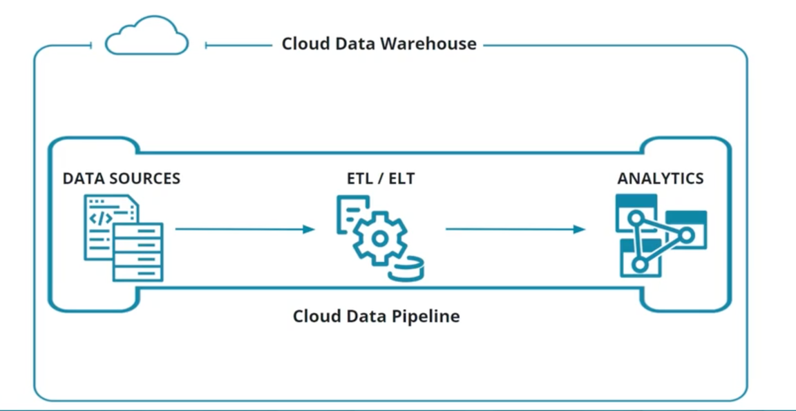
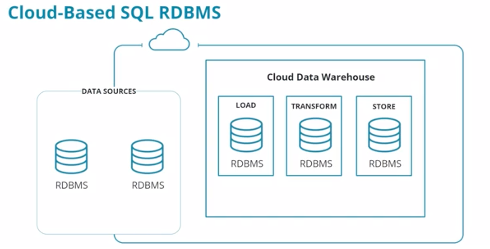

# ELT and Data Warehouse Technology in the Cloud

You will use several technologies when you’re building data warehouse solutions in a cloud environment.

You'll be working with:
- Database storage technologies for ingesting data as well as making it available to analytics consumers.
- Data pipeline technologies to move data from source to warehouse, as well as between the stages of the Extract, 
Transform and Load (ETL) processes.
- End-to-end data warehouse solution that provides the ability to manage the various parts of a data warehouse from a 
single application.

## Expert Perspective: Cloud Data Warehouses

Data warehouses have been around for a long time but recently they have received significant attention in the data 
industry in relation to cloud computing. With traditional, on-premise data warehouses, an organization needed to buy 
physical hardware to fit the pre-defined need. Modern cloud infrastructures allow data warehouses to be scaled on-demand 
in response to changing needs.

This ability to scale means modern cloud infrastructures can take full advantage of massively parallel processing in a 
changing data environment. When you run a data warehouse in the cloud, you should design for this flexible scaling and 
think carefully about data ingestion if your transactional systems reside on-premise.

Some of the key benefits of moving to cloud data warehouses from on-premise include:
- Scalability. This means large amounts of data can be loaded into the data warehouse environment, processed, and 
stored faster and with relative ease
- Another difference is cloud flexibility. This comes from the ability to add and remove different types of resources 
from data pipelines as needed. This allows for flexibility in the process as business needs change.
- Cost shifting is a result of leveraging cloud database technology to perform the costly and time-consuming 
transformation of data as the last part of the process rather than doing it earlier as is typical with on-premise data 
warehouses. By pushing it later, the business can prioritize which transforms they want to complete “just in time” for 
the business.

## From ETL to ELT

### ELT in Cloud Environments

Massive parallel processing and distributed file storage capabilities of cloud computing have led to new extract, 
transform, and load design patterns. Traditional ETL models have worked for decades but the introduction of massive 
scalability through cloud data warehousing has allowed us to flip the Transform and Load steps.

### ELT originated from ETL
The letters mean the same thing but the order is different in an important way. Since the T and L are swapped from TL 
to LT, this means the most significant difference between ETL and ELT is “Where does the transformation happen?”
- ETL: happens on an intermediate server
- ELT: happens on the destination server

This means rather than loading data directly into the final format of the destination data warehouse, data are loaded 
into the destination as either raw data or staging tables (or sometimes both). Only after loading is transformation 
performed.

The benefits of doing ELT include:
- Scalability - massive amounts of data can be loaded into the data warehouse environment with relative ease
- Flexibility - the Transform step takes place using the same tech stack as the data warehouse runs on allowing for 
more flexibility in the process as business needs change.
- Cost shifting - the Transform step is often the most costly and by doing it last, Data Engineers can perform Just In 
Time transformations to meet the highest priority business needs first
- Better performance for large datasets
- More flexibility for unstructured (NoSQL) datasets

### Additional Resource
Here's a good Microsoft article on ELT vs. ETL titled [Design ETL Data Loading](https://docs.microsoft.com/en-us/azure/synapse-analytics/sql-data-warehouse/design-elt-data-loading).

## Cloud Storage
In a cloud data warehouse the key components are:
- data sources
- ELT/ETL pipelines
- analytics applications
These components are  onnected by the cloud data pipeline.

### Cloud Managed SQL Storage

RDMS are found as:
- data sources both on-premise and in the cloud
- in the cloud data warehouse for loading transforming and storing data in the cloud
Data Warehouses in the cloud leverage many of the same SQL style, relational databases that are used for OLTP systems.
- Oracle 
- Microsoft SQL Server 
- PostgreSQL 
- MySQL 
- MariaDB

The major cloud providers provide all of these databases as managed databases meaning the user doesn't have to manage 
the hardware resources to gain optimal performance.
- Microsoft Azure 
  - Azure SQL Database (MS SQL Server)
  - Azure Database for MySQL 
  - Azure Database for MariaDB 
  - Azure Database for PostgreSQL
- GCP
  - Cloud SQL (MySQL, PostgreSQL, and MS SQL Server)
- AWS
  - Amazon RDS (MySQL, PostgreSQL, MariaDB, Oracle, MS SQL Server)

In an unmanaged database scenario, the responsibilities for the database server and its underlying system encompass:
- Configuring
- Monitoring
- Patching (process of applying updates to the software that runs the database and its underlying operating system. )
- Maintaining

Conversely, in a fully managed service, the cloud service provider assumes the responsibility for configuring and
maintaining the underlying system.

### Cloud Managed NoSQL Storage
The previous picture is also true for NoSQL databased, which are also fond at each of the steps represented.

ELT makes it easier to use many NoSQL database management systems in Data Warehousing scenarios. These database come in 
many flavors such as:
- Key value
- Document
- Column oriented
- Graph
- Time series

Each of the major cloud providers offers a variety of managed NoSQL databases:
- Azure - CosmosDB 
  - Gremlin - graph database 
  - MongoDB - document 
  - Cassandra - column oriented
- GCP 
  - Big Table - column oriented 
  - Firestore - document 
  - MongoDB Atlas - document
- AWS 
  - DynamoDB - Key value 
  - DocumentDB - document 
  - Keyspaces = column oriented 
  - Neptune - graph 
  - Time stream - time series

They are two primary ways Cloud Service Providers offer NoSQL databases:
- For some providers and some systems, a single platform provides multiple APIs to the various type of NoSQL databases
- For other providers, each type of NoSQL database is a offered as a separate service

## Cloud ETL Pipeline Services

ETL / ELT processes rely on data pipelines often built using cloud-based tools. Major Cloud providers service are:
- Azure Data Factory 
- AWS Glue 
- GCP Dataflow

In addition to these tools, a large number of companies offer cloud-based tools for solving ETL / ELT challenges. 
Some of the major tool providers in this space are:
- Informatica 
- Talend 
- Xplenty 
- Matillion

### Streaming Data Ingestion and Processing

One advantage of doing ELT over ETL is the ability to load large amounts of data quickly. One excellent example of 
this is ingesting streaming data. In modern architectures, this streaming data is often coming from Internet of Things 
(IoT) devices; however, it could be coming from more traditional sources such as server or transaction logs.

Each major cloud platform offers services for ingesting large amounts of streaming data:

- **Azure**: Streaming Analytics
- **AWS**: Kinesis
- **GCP**: Dataflow

In addition to these cloud services, there are several open source solutions that are highly effective for similar purposes:

- **Apache Kafka**: A distributed streaming platform used for building real-time data pipelines and streaming 
applications. Kafka is scalable and can handle high data throughput.
  
- **Apache Flink**: An open source stream processing framework for distributed, high-performance, always-available, 
and accurate streaming applications. Flink excels in processing large volumes of data in real time.
  
- **Apache Storm**: A real-time computation system for fast data processing. Apache Storm is adept at handling 
unbounded streams of data.
  
- **Apache NiFi**: Designed for automating the flow of data between systems, Apache NiFi supports scalable data routing, 
transformation, and system mediation logic.
  
- **RabbitMQ**: Primarily a message broker, RabbitMQ can also be utilized for streaming data. It supports various 
messaging protocols and is suitable for complex routing.
  
- **Redis Streams**: A component of the Redis database, offering capabilities for handling streaming data. Redis Streams 
is more limited compared to dedicated streaming platforms but is still effective for certain use cases.
