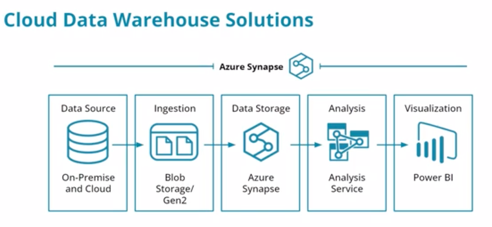
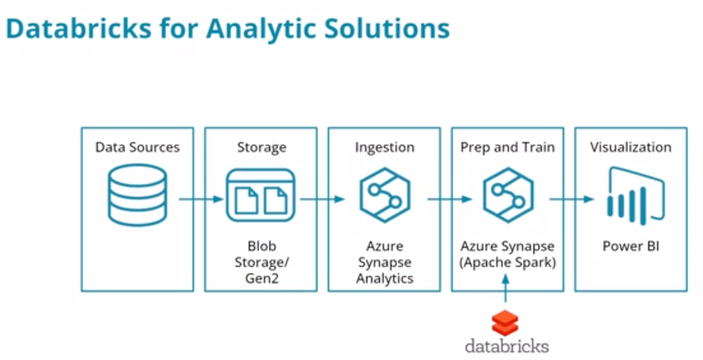

# Azure Data Warehouse Technology 

## Table of Contents

1. [Introduction to Cloud Data Warehouses with Azure](#introduction-to-cloud-data-warehouses-with-azure)
   - [Data Source and Ingestion](#data-source-and-ingestion)
   - [Data Storage and Analysis](#data-storage-and-analysis)
   - [Data Visualization](#data-visualization)

2. [Expert Perspective: Data Warehouse on Azure](#expert-perspective-data-warehouse-on-azure)
   - [Strengths of Azure](#strengths-of-azure)
   - [Cautions for Azure Data Warehousing](#cautions-for-azure-data-warehousing)
   - [Overall Assessment](#overall-assessment)

3. [Azure Data Warehouse Solutions](#azure-data-warehouse-solutions)
   - [Data Warehouse Analytics Solutions](#data-warehouse-analytics-solutions)
     - [Azure Synapse](#azure-synapse)
     - [Azure Databricks](#azure-databricks)
   - [Supporting Tools for Cloud Data Warehouse](#supporting-tools-for-cloud-data-warehouse)
     - [Cloud Data Storage](#cloud-data-storage)
     - [ETL / ELT Pipelines](#etl--elt-pipelines)

4. [Azure Components](#azure-components)
   - [Cloud Data Storage and ETL / ELT Pipelines](#cloud-data-storage-and-etl--elt-pipelines)

5. [Additional Resources](#additional-resources)

6. [When to Use Azure Components and Solutions](#when-to-use-azure-components-and-solutions)
   - [Use Cases for Azure Data Warehouse Components](#use-cases-for-azure-data-warehouse-components)

## Introduction to Cloud Data Warehouses with Azure

Azure is a popular platform choice for building data warehouses in the Cloud.
- The data source is often located in an on-premise network, although it can be located in the Cloud as well.
- Data ingestion is often accomplished using blob storage or similar technologies.
- Data storage can be accomplished using the warehouse platform, Azure Synapse.
- Data analysis can utilize Azure Analysis Services.
- Finally, data visualization is made possible using Microsoft Power BI.

### Expert Perspective: Data Warehouse on Azure

Microsoft is a Gartner Magic Quadrant leader in Cloud Database Management tools. The strengths of Azure in this space 
include:
- A comprehensive vision for their data tools 
- A clear migration path from on premise as well as other tools 
- Integrated multimodal capabilities for multiple data platforms

Cautions in this space include:
- Inconsistent product maturity levels 
- Pricing and cost challenges 
- Data architecture challenges for hybrid on-premise and cloud solutions

Overall, Microsoft's Azure platform offers a comprehensive suite of tools for providing end-to-end cloud data warehousing solutions.

## Azure Data Warehouse Solutions

Microsoft Azure tools to create Cloud Data Warehouse solutions include:

- **Data Warehouse Analytics Solutions**
  - Azure Synapse for comprehensive, integrated data warehousing and analytics
    - Synapse integrates with a broad range of data storage and pipelines technologies within the Azure environment
    - Synapse also provides analytics capabilities on top of the selected architecture
    - 
  - Azure Databricks for analytics built on Apache Spark
    - Microsoft Azure provides Databricks optimized for that Azure environment
    - There are three flavors of Databricks optimized in turn for:
      - SQL
      - Data Science and Engineering
      - Machine Learning
    - While Azure Databricks can be utilized in traditional data warehouse architectures, it is maybe more suited for
    data lake and lakehouse architectures
    - 

Microsoft Azure tools to support Cloud Data Warehouse solutions include:

- **Cloud Data Storage**
  - Azure Data Warehouse Gen 2 for traditional data warehouse architectures
  - Azure Dedicated SQL Pools for relational data storage
  - semi dtructured or unstructured data storage:
    - Blob storage for file-based storage
    - CosmosDB for NoSQL solutions such as column-oriented or document databases
  
- **ETL / ELT Pipelines**
  - Azure Data Factory for creating intelligent data integrations and data flows for multiple services
  - Azure Databricks for utilizing Spark to create ETL pipelines Azure Polybase for using TSQL to query blob storage in 
  support of ELT scenarios

## Azure Components

Microsoft Azure components, technologies, and services that support Cloud Data Warehouse solutions include:
- **Cloud Data Storage**
  - Azure Data Warehouse Gen 2 for traditional data warehouse architectures
  - Azure Dedicated SQL Pools for relational data storage
  - Blob storage for file-based storage
  - CosmosDB for NoSQL solutions such as column-oriented or document databases
- **ETL / ELT Pipelines**
  - Azure Data Factory for creating intelligent data integrations and data flows for multiple services
  - Azure Databricks for utilizing Spark to create ETL pipelines Azure Polybase for using TSQL to query blob storage in support of ELT scenarios

### Additional Resources
- [Azure Data Warehouse Gen 2 Overview](https://docs.microsoft.com/en-us/azure/storage/blobs/data-lake-storage-introduction)
- [Azure Dedicated SQL Pools Overview](https://docs.microsoft.com/en-us/azure/synapse-analytics/sql-data-warehouse/sql-data-warehouse-overview-what-is)
- [Azure Blob Storage Overview](https://docs.microsoft.com/en-us/azure/storage/blobs/storage-blobs-introduction)
- [Azure CosmosDB Overview](https://docs.microsoft.com/en-us/azure/cosmos-db/introduction)
- [Azure Data Factory Overview](https://docs.microsoft.com/en-us/azure/data-factory/introduction)
- [Azure Databricks Overview](https://docs.microsoft.com/en-us/azure/databricks/scenarios/what-is-azure-databricks)

## When to Use Azure Components and Solutions

Azure Data Warehouse components are similar to offerings by both AWS and Google. Here are some times when you should use
Azure Data Warehouse components to build a data warehouse solution:
- When the data infrastructure already contains Microsoft technologies such as Microsoft SQL Server
- When an on premise solution needs to be moved to the cloud for scaling
- When you have large amounts of data that need an ELT solution to quickly ingest data from a wide variety of sources
