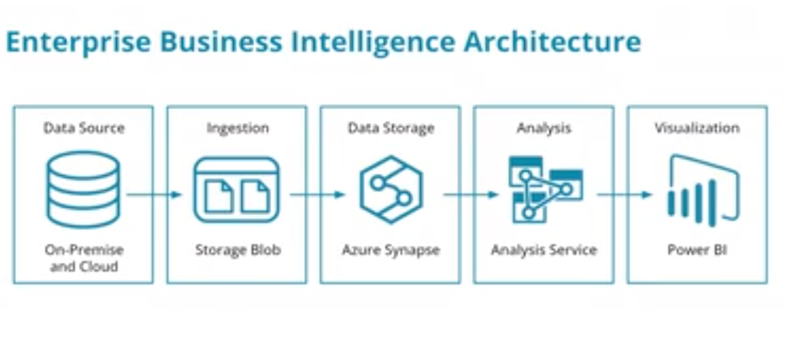
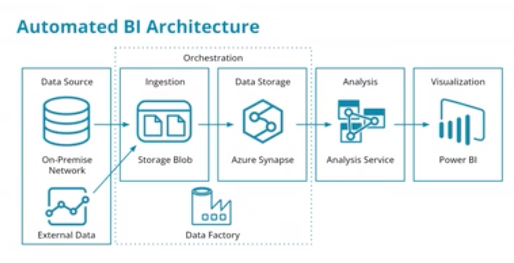
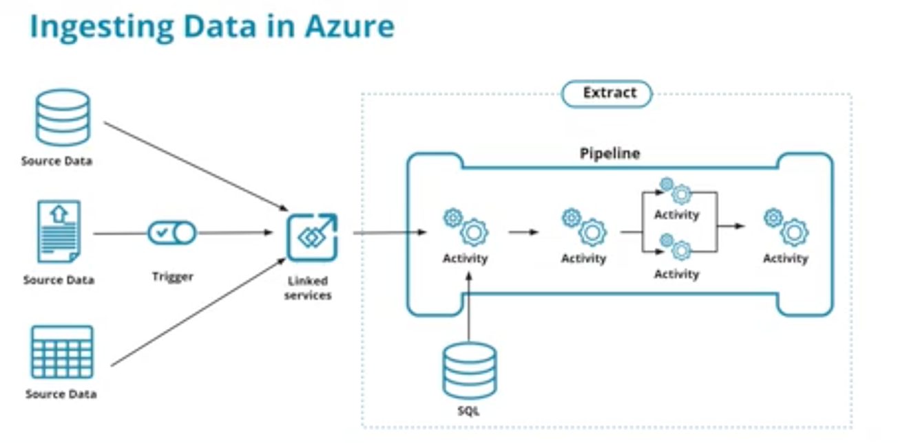
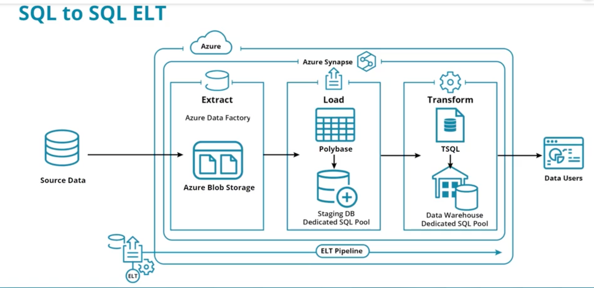

# Implementing Data Warehouses in Azure

## Azure Data Warehousing Pricing

Creating data warehouses using Microsoft Azure technologies requires an understanding of the purpose of each component. 
Azure data warehouse pricing models include:
- Batch Data Ingestion
- Streaming Data Ingestion
- SQL Data Storage
- NoSQL Data Storage
- Big Data Analytics
- Log and Telemetry Streaming Analytics

In some cases, Azure resource pricing is time-based (e.g. Cosmos DB) and in other cases, it is based on the amount of 
data stored or processed (e.g. Blob storage).

Your data warehouse solution in Azure may include all or just some of these options and the pricing models vary from 
the amount of data stored/processed to time-based billing.

Benefits of the mix and match approach:
- Pay for just what you need
- Tailor solution to business needs not the platform

Cautions for the mix and match approach:
- Need to understand a variety of billing models
- Must understand data and time needs for each of the components to understand the total cost for the solution

## Azure Data Warehouse Architectures

### Enterprise BI Architecture

A typical Enterprise DW Architecture involves:
- A Data Source (MS SQL Server)
- An Ingestion Mechanism (Azure Blob Storage)
- Data Storage (Azure Synapse)
- Analysis (Azure Analysis Service)
- Visualization (PowerBI)

### Automated Enterprise BI Architecture

An Automated Enterprise BI Architecture has the same components with the Azure Blob Storage and Azure Synapse components 
orchestrated using Azure Data Factory.

### Additional Resource
Microsof t documentation on [Azure Data Warehouse Architectures](https://docs.microsoft.com/en-us/azure/architecture/data-guide/relational-data/data-warehousing)

## Ingesting Data at scale into Azure Synapse

Ingesting data at scale into Azure Synapse involves:
- **Creating linked services**: a linked service is where you define your connection information to other services
- **Creating a pipeline**: A pipeline contains the logical flow for an execution of a set of activities
- **Using a trigger or a one-time data ingestion**: You can manually start a data ingestion or you can schedule a trigger
  

### Additional Resources:
[Ingesting data into Azure Synapse](https://docs.microsoft.com/en-us/azure/synapse-analytics/quickstart-copy-activity-load-sql-pool)

## SQL to SQL ELT in Azure

When using Microsoft Azure to implement a data warehouse, the best solution is often to pergorm a SQL to SQL ELT.

Doing a SQL to SQL ELT in Azure involves:
- Starting with data ingested into either Blob Storage or Azure Delta Lake Gen 2
- Create EXTERNAL staging tables in the Data Warehouse
- Transform data from staging tables to DW tables

**staging tables**: tables that are used to temporarily store data that will be processed and loaded into a data warehouse

Once the extract process has landed data into azure blob storage, SQL can be used for the last two steps: load and 
transform: 
- for the load step, Microsoft SQL server Polybase provides a fast, highly efficient method for loading data
from Azure Blob Storage into staging tables created in Azure dedicated SQL pools as external tables.
- when transforming data, Microsoft SQL T-SQL can be used again in Azure dedicated SQL pools to transform data from
staging table schemas to the final data warehouse schemas.

### Dedicated or Serverless SQL Pools?
In Azure Synapse Analytics, there are two types of SQL pools to choose from: dedicated SQL pools and serverless SQL 
pools. You can use either for ELT pipeline processes and staging data. They offer different functionalities, performance 
characteristics, and pricing models.
- Serverless SQL Pools are created when you create a Synapse Analytics resource in Azure.
- Dedicated SQL Pools have to be created as a separate resource.

#### Azure Dedicated SQL Pools

Dedicated SQL pools are designed to provide a high-performance, scalable, and cost-effective solution for big data
workloads. They utilize a Massively Parallel Processing (MPP) architecture. This architecture enables users to perform 
queries faster, especially for complex analytical queries. Dedicated SQL pools are provisioned with a fixed amount of 
resources and are billed based on the resources allocated, regardless of usage.

In a Synapse Analytics production data warehouse, you likely would use Dedicated SQL Pools.

#### Azure Synapse Analytics Serverless SQL Pools

Serverless SQL pools provide a pay-per-query model, which means you only pay for the resources used by each executed 
query. They are designed to handle both small and large-scale data processing tasks and can automatically scale 
resources based on workload requirements. Serverless SQL pools do not require any upfront provisioning or resource 
allocation.
- For development workloads, ad-hoc querying, or volatile workloads, you can use serverless SQL pools.
- Use Serverless SQL pools if you are using the Udacity Azure Cloud Lab.

### Additional Resource
[SQL to SQL ELT in Azure](https://docs.microsoft.com/en-us/azure/architecture/data-guide/relational-data/etl)

